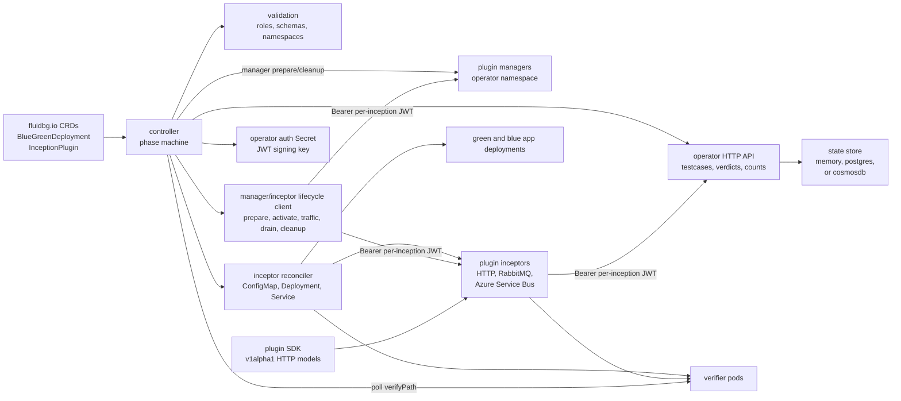
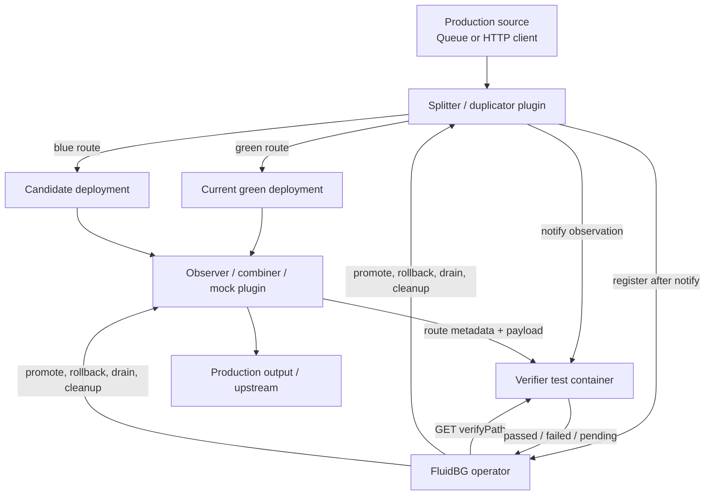
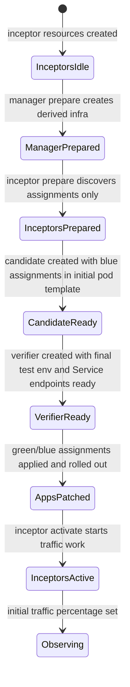
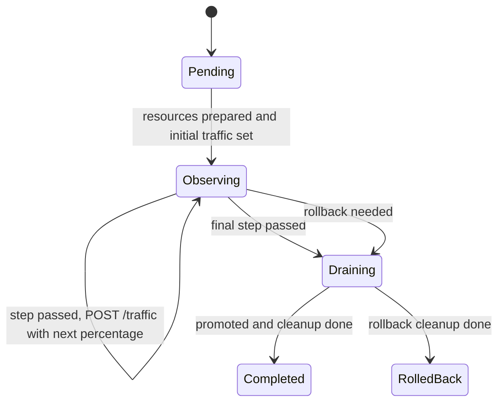

# FluidBG Operator Architecture

## Overview

FluidBG is a Kubernetes operator for blue-green and progressive delivery of queue
and HTTP workloads. A candidate deployment is exposed to controlled live traffic,
one verifier container decides whether observed test cases passed, and the operator
promotes or rolls back from configured success criteria.

The operator is intentionally transport-agnostic. Transport behavior lives in
`InceptionPlugin` resources, optional privileged plugin managers, and
per-inception plugin inceptors. A
`BlueGreenDeployment` selects plugins through named `inceptionPoints`, activates
one or more roles, and provides plugin-specific config. The operator renders the
declared Kubernetes resources, calls lifecycle endpoints, tracks test cases, and
removes temporary resources after promotion or rollback.

## Component Architecture





## Core Concepts

| Term | Current Meaning |
|---|---|
| `BlueGreenDeployment` | Names the green deployment, candidate deployment template, inception points, one verifier, and promotion strategy. |
| `InceptionPoint` | A named traffic interception point. It references one plugin, activates `roles`, supplies arbitrary plugin `config`, and can define drain options/resources. |
| `InceptionPlugin` | A namespaced plugin registration CRD. It declares image, topology, supported roles, inceptor pod settings, optional manager endpoint, lifecycle paths, field namespaces, config schema, injected env vars, and optional features. |
| Plugin manager | Long-running privileged control-plane component in the operator namespace. It creates and deletes derived infrastructure after verifying the per-inception JWT. |
| Plugin inceptor | Per-inception traffic component in the application namespace. It moves, observes, writes, mocks, or combines traffic but should not hold infrastructure-admin credentials when a manager is configured. |
| Plugin role | The behavior activated for an inception point: `duplicator`, `splitter`, `combiner`, `observer`, `mock`, `writer`, or `consumer`. |
| Verifier test container | User-owned HTTP service that stores domain observations and returns `passed: true`, `passed: false`, or `passed: null` for a `testId`. |
| State store | Operator-global persistence for registered test cases and counts. Implemented backends are `memory`, `postgres`, and `cosmosdb`. |
| Progressive shifting | Weighted blue traffic controlled by the operator through inceptor lifecycle `trafficShiftPath` calls. |
| Operator auth Secret | User-selected Kubernetes Secret containing the JWT signing key used to mint per-inception plugin tokens. |

## Authentication Boundary

FluidBG uses one user-selected signing Secret per operator instance and one
signed JWT per inception point. The signing Secret must live in the operator
namespace. The operator signs the token from the configured Secret and injects
only the token into the inceptor as `FLUIDBG_PLUGIN_AUTH_TOKEN`.

The token is the shared credential for that inception point:

- Operator to manager and inceptor lifecycle, drain, cleanup, and traffic-shift calls use
  `Authorization: Bearer <token>`.
- Built-in inceptors require the bearer token to exactly match their injected
  `FLUIDBG_PLUGIN_AUTH_TOKEN` on operator-owned endpoints. They do not receive
  the signing key and do not verify JWT signatures locally.
- Built-in managers receive the signing key from the operator namespace and
  verify JWT signatures before creating or deleting privileged infrastructure.
- Plugin to operator `/testcases` calls use the same bearer token.
- The operator verifies the JWT signature and trusts the token claims, not the
  message payload, for caller identity. Registration is rejected if the request
  body identity does not match the verified `blue_green_ref` and
  `inception_point` claims.
- Tokens also carry the BGD UID. Any operator replica may receive a plugin
  callback, but it must read current Kubernetes state and reject registrations
  if the UID no longer exists, no longer matches, or the BGD is deleting or
  terminal.

The signing Secret is not rollout-owned and is not cleaned up by the operator.
Rollout cleanup removes temporary inception resources and waits for Deployments,
Services, ConfigMaps, Secrets, and Pods carrying inception labels to disappear.

Older docs described `mode`, `direction`, and transport-specific orchestration
kinds. The current CRD model is role-based. `FLUIDBG_MODE` remains only as a
backward-compatible SDK fallback; the operator injects `FLUIDBG_ACTIVE_ROLES`.

## CRD Model

All Kubernetes resources use API group `fluidbg.io/v1alpha1`.

### `InceptionPlugin`

An `InceptionPlugin` declares the reusable plugin contract:

```yaml
apiVersion: fluidbg.io/v1alpha1
kind: InceptionPlugin
metadata:
  name: http
spec:
  description: "HTTP transport plugin for observing, mocking, and writing HTTP traffic"
  image: ghcr.io/dlahmad/fbg-plugin-http:latest
  supportedRoles: [splitter, observer, mock, writer]
  topology: standalone
  lifecycle:
    preparePath: /prepare
    activatePath: /activate
    drainPath: /drain
    drainStatusPath: /drain-status
    cleanupPath: /cleanup
    trafficShiftPath: /traffic
  features:
    supportsProgressiveShifting: true
  fieldNamespaces: [http]
  configSchema:
    type: object
  inceptor:
    ports:
      - name: http
        containerPort: 9090
```

Important fields:

| Field | Meaning |
|---|---|
| `supportedRoles` | Roles this plugin can run for an inception point. |
| `topology` | `standalone`. |
| `fieldNamespaces` | Filter/selector namespaces supported by the plugin, for example `http` or `queue`. |
| `configSchema` | JSON Schema used by the operator to validate the inception point config. |
| `inceptor` | Pod ports, volume mounts, labels, annotations, and service account for the per-inception traffic component. |
| `manager` | Optional Service endpoint for the privileged manager in the operator namespace. |
| `lifecycle` | HTTP endpoints called by the operator for prepare, activate, drain, cleanup, and traffic shifting. |
| `injects` | Env vars the operator patches into green, blue, or the verifier container from plugin config/template values. |
| `features.supportsProgressiveShifting` | Required for progressive strategies that use splitter plugins. |

### `BlueGreenDeployment`

The current `inceptionPoints` shape is:

```yaml
inceptionPoints:
  - name: incoming-orders
    pluginRef:
      name: rabbitmq
    roles: [duplicator, observer]
    drain:
      maxWaitSeconds: 60
    config:
      duplicator:
        inputQueue: orders
        greenInputQueue: orders-green
        blueInputQueue: orders-blue
        greenInputQueueEnvVar: INPUT_QUEUE
        blueInputQueueEnvVar: INPUT_QUEUE
      observer:
        testId:
          field: queue.body
          jsonPath: $.orderId
        match:
          - field: queue.body
            jsonPath: $.type
            matches: "^order$"
        notifyPath: /observe/{testId}/incoming-orders
```

Promotion supports data-verification and custom-verification criteria:

```yaml
promotion:
  data:
    minTestCases: 100
    successRate: 0.98
    timeoutSeconds: 1800
  strategy:
    type: progressive
    progressive:
      steps:
        - { trafficPercent: 5, observeCases: 20, successRate: 0.99 }
        - { trafficPercent: 25, observeCases: 50, successRate: 0.98 }
        - { trafficPercent: 100, observeCases: 100, successRate: 0.98 }
      rollbackOnStepFailure: true
      stepTimeoutMinutes: 15
```

`minTestCases` and progressive `observeCases` are finalized sample thresholds.
Only passed, failed, and timed-out cases count toward the threshold.
Progressive `observeCases` values are cumulative per rollout, not per-step
deltas. For example, steps `3`, `8`, `12` advance at 3 finalized candidate
cases, then 8 total finalized candidate cases, then promote at 12 total
finalized candidate cases. Newly registered pending cases do not force the
operator to chase a moving tail of continuous traffic once the configured
finalized sample has already met the success rate. Pending cases can still
force rollback while observing if even treating every pending case as a future
pass cannot recover the required success rate.

`candidatePatch` is an optional, typed test-time overlay for the candidate
DeploymentSpec. It is applied only while the candidate is being tested. On
promotion, the operator reapplies the canonical `deployment.spec` before the
candidate is marked green.

```yaml
deployment:
  spec:
    replicas: 10
    selector:
      matchLabels: { app: orders-blue }
    template:
      metadata:
        labels: { app: orders-blue, fluidbg.io/name: orders }
      spec:
        containers:
          - name: orders
            image: ghcr.io/acme/orders:2.0.0
candidatePatch:
  replicas: 2
```

The patch supports optional DeploymentSpec fields that are safe to change for
test time: `replicas`, `strategy`, `minReadySeconds`,
`revisionHistoryLimit`, `paused`, `progressDeadlineSeconds`, and `template`.
It intentionally does not expose `selector`, because changing selectors during a
rollout can orphan ReplicaSets or make readiness and service routing ambiguous.
Nested objects use JSON merge-patch semantics; arrays such as
`template.spec.containers` are replaced as whole arrays if set.

### State Store

The state store is operator-global, not selected per `BlueGreenDeployment`.
`memory` is useful for development and tests, but it is blocked when the Helm
chart is configured with more than one operator replica. HA deployments must use
a shared backend: Postgres or Azure Cosmos DB. Both persistent backends support
secret-based credentials and AKS workload identity.

The operator watches BGDs cluster-wide, limited by its Kubernetes RBAC.
Internally, test case state is keyed as `namespace/name`, not just by BGD name,
so two teams can use the same BGD name in different namespaces without sharing
verdicts, counts, or cleanup state.

With multiple operator replicas, one BGD is reconciled under one short-lived
Kubernetes `Lease`. The lease is keyed by BGD identity, renewed while reconcile
work is in progress, and blocks other replicas from touching that BGD's store
records, plugin manager resources, inceptor pods, Deployments, or cleanup state.
If the holder pod dies, renewal stops and another replica can take over after
the lease duration. Different BGD resources use different leases and can
reconcile concurrently.

At rollout start, the operator stores an internal snapshot of the
`BlueGreenDeployment.spec` used by that rollout. If the user updates the BGD
while it is still `Pending`, `Observing`, `Promoting`, or `Draining`, the
default behavior is to defer the new generation. The active rollout continues
using the snapshot so promotion, rollback, drain, plugin cleanup, and test
cleanup address the same resources that were created at rollout start. Status
gets an `UpdateDeferred=True` condition until the active rollout reaches
`Completed` or `RolledBack`; then the operator clears the old snapshot and
starts the new generation.

Users can opt into immediate replacement with:

```yaml
updatePolicy:
  activeRollout: force-replace
```

`force-replace` is intentionally explicit because it trades safety for
operator responsiveness. The operator does not wait for the active test plan to
finish. Instead, it immediately starts the rollback drain for the frozen active
rollout, tells plugins to restore traffic to the current green path, waits for
normal `drainStatusPath` completion or the configured drain timeout, runs
cleanup, and only then starts the new generation as the next candidate. This
also works when no test case has been observed yet; drain/cleanup is tied to
the active inception resources, not to test-case existence. This
preserves the normal plugin drain guarantees; the additional risk is that the
candidate being replaced is interrupted and any in-flight candidate-side work is
handled by the same rollback/drain guarantees and timeouts as a failed rollout.
The interrupted rollout reaches `RolledBack`; after its terminal cleanup the
replacement generation resets to `Pending` and starts normally.

Status phase updates use optimistic concurrency on the status subresource:
the operator reads the latest status object and replaces it with the observed
`resourceVersion`. If another writer changed status between read and write, the
API server returns a conflict and the stale write is ignored.

Store records are short-lived rollout state, not an audit log. The operator
keeps pending cases while the owning BGD still exists. After a BGD reaches a
terminal state or is deleted through the finalizer path, temporary Kubernetes
resources are removed and all cases for that BGD are deleted from the store.
Test-case mutations are keyed by `(blueGreenRef, testId)`, not by `testId`
alone, so independent BGDs can observe the same application-level test id
without sharing verdicts or retry state.

Forced deletion is handled by an orphan sweeper. It periodically collects BGD
refs from the store and from Kubernetes resources labeled
`fluidbg.io/blue-green-ref`, compares them with existing BGD CR names, and
cleans any ref whose CR no longer exists. Unpromoted candidate deployments are
labeled so they can be removed after a forced delete; the label is cleared when
the candidate is promoted to the active green deployment. Orphan cleanup uses
the same lease mechanism before deleting resources or store rows.

## Operator Reconciliation

For one `BlueGreenDeployment`, reconciliation does the following:

1. Validate tests, promotion settings, plugin references, supported roles,
   supported field namespaces, plugin config schemas, and progressive capability.
2. Record the rollout generation and store an internal spec snapshot.
3. Resolve the current green Deployment and validate that progressive strategy,
   if configured, is supported by the selected splitter plugin.
4. Call manager `preparePath` endpoints with a per-inception JWT, secured
   config, and active-inception inventory. The manager creates privileged
   resources and returns scoped `inceptorEnv`.
5. Render inceptor ConfigMaps, Deployments, and Services from `InceptionPlugin`
   with secured config, per-inception bearer token, and manager-provided
   `inceptorEnv`.
6. Start plugin inceptors idle. They do not move traffic until activation.
7. Call inceptor `preparePath` endpoints for non-traffic setup and assignment
   discovery. Inceptors must stay idle after `preparePath`; they may create
   non-privileged local resources and return green/blue assignments, but they
   must not consume, proxy, observe, or write traffic yet.
8. Create/update the candidate Deployment from `deployment.spec`, applying
   `candidatePatch` and blue-targeted assignments directly into the initial
   pod template. This prevents the candidate from starting with production or
   default transport wiring.
9. Render verifier test resources from native Kubernetes `DeploymentSpec` and
   `ServiceSpec`, with test-targeted template assignments already included in
   the initial pod template. The operator then waits for verifier Deployment
   availability and Service endpoints. If a verifier needs application-level
   startup checks, define a normal Kubernetes `readinessProbe` in the test
   Deployment.
10. Patch green/blue application assignments, then wait for those rollouts.
11. Call inceptor `activatePath`. Only this transition may start queue
   consumption, HTTP proxying, observation callbacks, writer traffic, or
   combiner movement.
12. Register and poll test cases through the operator HTTP API and verifier
   `verifyPath`.
13. Apply progressive traffic updates by calling the inceptor `trafficShiftPath`.
14. On promotion, reapply canonical `deployment.spec` to the candidate and wait
   until it is ready before marking it green.
15. On promotion or rollback, enter draining, call inceptor `drainPath`, poll
   `drainStatusPath`, then call inceptor and manager `cleanupPath`.
16. Remove temporary test/inceptor resources and restore direct assignment values
   where plugins declared restore templates.
17. If a new BGD generation appears during the rollout, keep using the snapshot
   and mark `UpdateDeferred=True` by default. If
   `updatePolicy.activeRollout: force-replace` is set before the rollout is
   already draining, start rollback-style draining for the active snapshot and
   start the new generation after that drain/cleanup completes.
18. Independently, the orphan-cleanup loop calls manager `syncPath` with the
   active-inception inventory so missed cleanup can be repaired after crashes or
   forced BGD deletion.

The operator also prevents two rollouts of the same `BlueGreenDeployment` from
colliding while the previous rollout's temporary inception resources still
exist. Different `BlueGreenDeployment` names can run concurrently because
generated resource names include namespace, BGD name, BGD UID, inception point,
role, and logical resource purpose.

Pending setup uses this state machine:



During `InceptorsIdle`, `ManagerPrepared`, `InceptorsPrepared`,
`CandidateReady`, `VerifierReady`, and `AppsPatched`, inceptors do not move
application traffic. The old green workload remains live until the rolling
update has completed. Test verifier readiness cannot receive observer callbacks
until after `InceptorsActive`.

## GitOps Status

The CR keeps `status.phase` and also publishes conventional conditions for
GitOps health checks:

| Condition | Active rollout | Successful rollout | Failed rollout |
| --- | --- | --- | --- |
| `Ready` | `False` | `True` | `False` |
| `Progressing` | `True` | `False` | `False` |
| `Degraded` | `False` | `False` | `True` |

`Pending`, `Observing`, `Promoting`, and `Draining` are progressing.
`Completed` is ready. `RolledBack` is degraded. Each condition includes
`reason`, `message`, `observedGeneration`, and `lastTransitionTime`.

## Plugin Inceptor Contract

Standalone inceptor containers receive these operator-managed env vars:

| Env Var | Meaning |
|---|---|
| `FLUIDBG_OPERATOR_URL` | Base URL of the operator API. |
| `FLUIDBG_TESTCASE_REGISTRATION_URL` | Full operator URL for registering test cases. |
| `FLUIDBG_TEST_CONTAINER_URL` | Base URL of the selected verifier test service. |
| `FLUIDBG_TESTCASE_VERIFY_PATH_TEMPLATE` | Verifier path template, for example `/result/{testId}`. |
| `FLUIDBG_INCEPTION_POINT` | Active inception point name. |
| `FLUIDBG_BLUE_GREEN_REF` | Owning `BlueGreenDeployment` name. |
| `FLUIDBG_ACTIVE_ROLES` | Comma-separated roles activated for this plugin instance. |
| `FLUIDBG_CONFIG_PATH` | Mounted plugin config file path, currently `/etc/fluidbg/config.yaml`. |
| `FLUIDBG_PLUGIN_AUTH_TOKEN` | Per-inception JWT used for operator, manager, and inceptor calls. |
| `FLUIDBG_INCEPTOR_INFRA_DISABLED` | `true` when a manager owns privileged resource setup and cleanup. |

Plugins should import shared Rust types from `sdk/rust` or generate clients from
`sdk/spec/plugin-api-v1alpha1.openapi.yaml`. The SDK defines lifecycle payloads,
assignments, test-case registration, observer notifications, traffic routes, and
traffic shifting.

## Lifecycle Endpoints

The operator calls lifecycle endpoints declared by the plugin CRD:

| Endpoint | Called When | Expected Behavior |
|---|---|---|
| `POST /prepare` | Before candidate/test traffic setup | Perform setup and return green/blue assignments; must not move traffic. |
| `POST /activate` | After candidate, verifier, and app assignment rollouts are ready | Start consuming, proxying, observing, writing, or combining traffic. |
| `POST /drain` | After promotion or rollback decision | Stop accepting new temporary work and return assignments that move the surviving deployment toward direct production wiring. |
| `GET /drain-status` | While phase is `Draining` | Return whether temporary resources are drained. Missing endpoint means drain-complete. |
| `POST /cleanup` | After drain completion or timeout | Delete derived transport resources and leave plugin safe to terminate. |
| `POST /traffic` | Initial rollout and progressive step changes | Update blue traffic percentage without restarting the plugin pod. |

Traffic shifting uses this SDK payload:

```json
{ "trafficPercent": 25 }
```

Built-in plugins keep the current percentage in process memory and update it via
`POST /traffic`. `FLUIDBG_TRAFFIC_PERCENT` is only the startup default; normal
progressive operation does not patch env vars or restart plugin pods.

## Progressive Shifting

Progressive strategy is allowed only when a referenced splitter plugin advertises
`features.supportsProgressiveShifting: true`. The operator enforces that
requirement before rollout.



## Failure Behavior

The operator is conservative about promotion. It does not promote from green
readiness alone; it promotes only from registered verification cases that the
verifier resolved successfully.

| Situation | Operator behavior |
|---|---|
| Test Deployment or Service endpoint never becomes ready | The BGD stays before `Observing`; inceptors are not activated and no traffic is intentionally routed to them. Reconciliation retries until the resources become ready or the user changes/deletes the BGD. |
| Plugin cannot deliver `observer.notifyPath` | The plugin must not register the test case. The operator sees no false pass and keeps waiting for valid cases until promotion timeout or rollback criteria apply. |
| Registered case stays pending | The tracker polls `verifyPath` until the case timeout, then marks it timed out. Timed-out cases count against the success rate. |
| Verifier returns failure | The case is failed. Hard-switch and progressive strategies roll back once the configured success threshold cannot be recovered. |
| Minimum case count or success threshold is not met before promotion timeout | The rollout rolls back and then drains/cleans temporary resources. |
| Final hard-switch or progressive step passes while newer cases are pending | The rollout can enter `Draining` after the finalized sample passes, but verifier/test resources stay alive until every already-registered case is terminal: passed, failed, or timed out. This prevents cleanup from deleting evidence for an admitted case. |
| Final hard-switch or progressive step passes | The rollout enters `Draining`, promotes the candidate wiring, waits for plugin drain status and terminal registered cases, then cleans inception/test resources and marks `Completed`. |
| Drain does not finish before the inception point drain timeout | The operator records `TimedOutMaybeSuccessful` for that drain and proceeds to cleanup. This is explicit risk reporting, not a zero-loss guarantee. |
| BGD is updated during an active rollout | By default the update is deferred. The active rollout continues from its stored spec snapshot and status includes `UpdateDeferred=True`; the new generation starts after terminal cleanup. |
| BGD is updated with `updatePolicy.activeRollout: force-replace` before drain starts | The operator stops waiting for the active tests, starts rollback-style plugin drain for the frozen active snapshot, restores traffic to the current green path, waits for drain completion or configured drain timeouts, marks the interrupted rollout `RolledBack`, cleans up, then starts the new generation. |
| BGD is updated with `updatePolicy.activeRollout: force-replace` after drain already started | The operator continues the already-started drain with the frozen snapshot. If promotion had already switched green, it does not reconstruct the deleted previous green; it finishes that drain and then starts the new generation. |
| BGD is force-deleted without finalizers | Orphan cleanup uses store references and `fluidbg.io/blue-green-ref` labels to remove remaining plugin, test, secret, and store records when the operator runs again. |

Traffic route semantics are plugin-owned:

| Route | Meaning |
|---|---|
| `blue` | Resource was routed only to the candidate path. |
| `green` | Resource was routed only to current green. |
| `both` | Resource was duplicated to green and blue. |
| `unknown` | Plugin cannot determine the route. |

RabbitMQ and HTTP both support progressive splitting where it makes transport
sense. RabbitMQ uses stable hashing to decide whether a message goes to blue at
the current percentage. HTTP uses the same route decision for proxy traffic.
Observer filters select which messages or requests become verification signals;
they must not be used as transport-routing filters for normal application
traffic.

## Built-In Plugins

| Plugin | Roles | Topology | Progressive | Notes |
|---|---|---|---|---|
| `http` | `splitter`, `observer`, `mock`, `writer` | `standalone` | yes | One combined HTTP service exposes proxy/splitter, observer/mock behavior, and `/write`. |
| `rabbitmq` | `duplicator`, `splitter`, `observer`, `writer`, `consumer`, `combiner` | `standalone` | yes | Handles queue fanout, weighted split, observer notifications, writes, consumption, and output combining. |
| `azure-servicebus` | `duplicator`, `splitter`, `observer`, `writer`, `consumer`, `combiner` | `standalone` | yes | Mirrors the RabbitMQ queue model for Azure Service Bus with connection-string and workload-identity auth. |

Standalone plugin manifest examples live in `builtin-plugins/`. The Helm chart
templates the installable built-in plugin registrations for each configured
namespace.

## Filtering, Selectors, and Field Namespaces

Plugins declare supported field namespaces. The built-in HTTP plugin supports
`http`; the RabbitMQ plugin supports `queue`.

Examples:

```yaml
match:
  - field: http.method
    equals: POST
  - field: http.path
    matches: "^/orders$"
  - field: http.body
    jsonPath: $.type
    matches: "^order$"
```

```yaml
testId:
  field: queue.body
  jsonPath: $.orderId
```

Exactly one of `equals` or `matches` is valid for a match condition. Selectors
can use a field plus optional `jsonPath`/`pathSegment`, or a static `value`.

## Test Container Contract

Verifier containers hold observation state. The operator does not infer
application correctness from message bodies or HTTP payloads. Plugins notify the
verifier, register test cases when appropriate, and the operator polls the
verifier result path.

`spec.test` defines exactly one verifier with a native Kubernetes `deployment` and `service`.
Container image, ports, env vars, resources, probes, security context, commands,
and similar runtime details belong in the Deployment spec. The operator only
adds FluidBG ownership labels/selectors, creates a Service with the same runtime
name, waits for Deployment availability, and derives the verifier base URL from
the first Service port.

Verifier response:

```json
{ "testId": "order-17", "passed": true, "errorMessage": null }
```

Pending response:

```json
{ "testId": "order-17", "passed": null, "status": "observing" }
```

Observer notifications include infrastructure route metadata in the body:

```json
{
  "testId": "order-17",
  "inceptionPoint": "incoming-orders",
  "route": "both",
  "payload": {}
}
```

For RabbitMQ, `both` reflects duplicator fanout to blue and green. For combiner
observations, the route is derived from the source queue, not from application
payload content.

## Project Structure

```text
operator/              Rust operator crate, CRDs, controller, state stores, HTTP API
plugins/http/          Combined HTTP splitter/observer/mock/writer plugin
plugins/rabbitmq/      Combined RabbitMQ duplicator/splitter/combiner/writer/observer plugin
sdk/                   Versioned Rust SDK and language-neutral OpenAPI specs
crds/                  Generated CRD manifests
builtin-plugins/       Standalone InceptionPlugin manifest examples
charts/                Helm chart with CRDs and hook-managed built-in plugin CRs
deploy/                Raw operator deployment and RBAC
e2e/                   Kind-based end-to-end suite
testenv/               RabbitMQ, Postgres, and kind support manifests
```

Important implementation boundaries:

| Area | Responsibility |
|---|---|
| `operator/src/controller.rs` | Reconcile phase machine. |
| `operator/src/controller/plugin_lifecycle.rs` | Plugin lifecycle HTTP client. |
| `operator/src/controller/promotion.rs` | Promotion validation and decision logic. |
| `operator/src/plugins/reconciler.rs` | Plugin-agnostic Kubernetes resource rendering. |
| `sdk/rust` | Shared model and helper types consumed by built-in plugins. |

## Safety Properties

- Green keeps serving unless the configured promotion path replaces it.
- Temporary plugin and test resources are removed after promotion or rollback.
- Forced-deleted BGDs are recovered by orphan cleanup using store refs and
  `fluidbg.io/blue-green-ref` labels.
- Draining gives plugins a chance to move or consume temporary work before
  cleanup; drain timeout is explicit and reflected in status.
- Plugins notify verifiers before operator registration, so a registered pass
  implies the verifier endpoint accepted the observation first.
- Progressive shifting changes plugin state through lifecycle HTTP calls, so it
  does not require plugin pod restarts.
- The test container owns semantic correctness; application payload formats are
  not part of the operator contract.
- `postgres` and `cosmosdb` state stores preserve registered cases across operator restarts and support multi-replica operator deployments.
- Store records are deleted when their BGD is terminal, deleted, or detected as
  orphaned after a forced delete.
- CRD models and plugin API models are versioned under `v1alpha1`.
