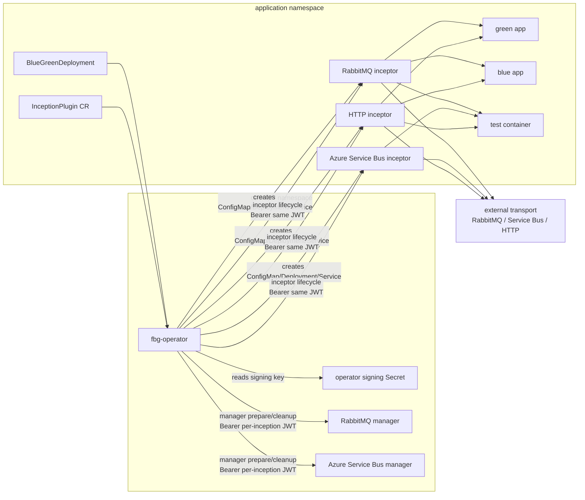
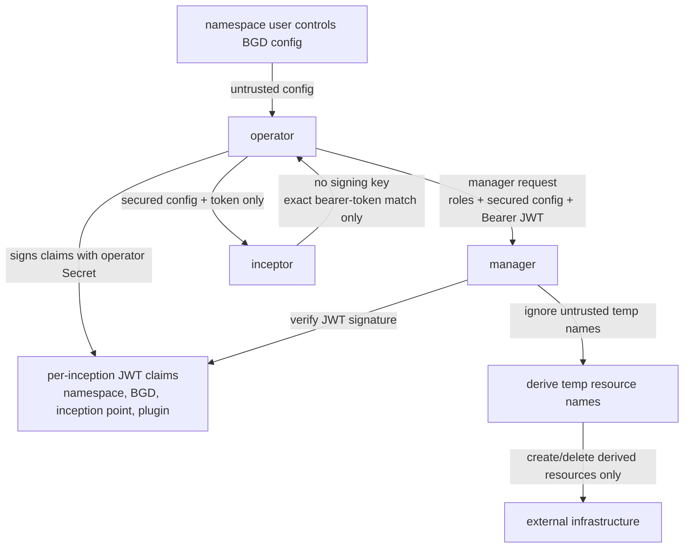
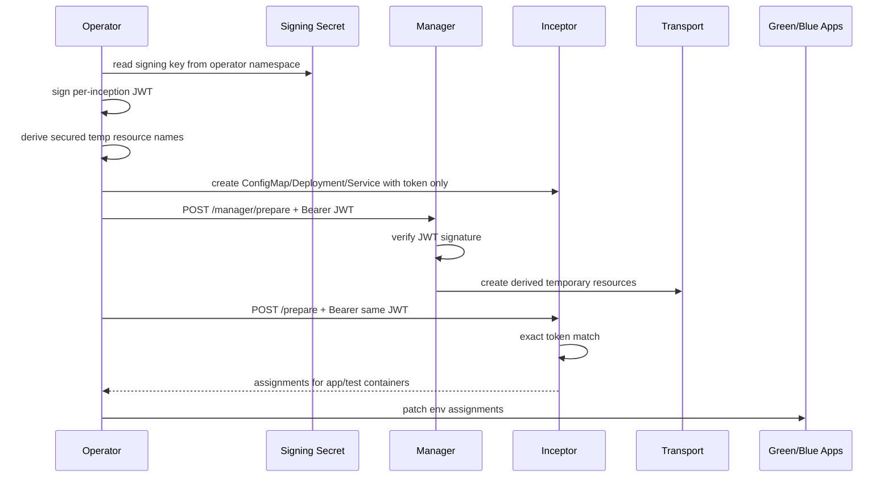
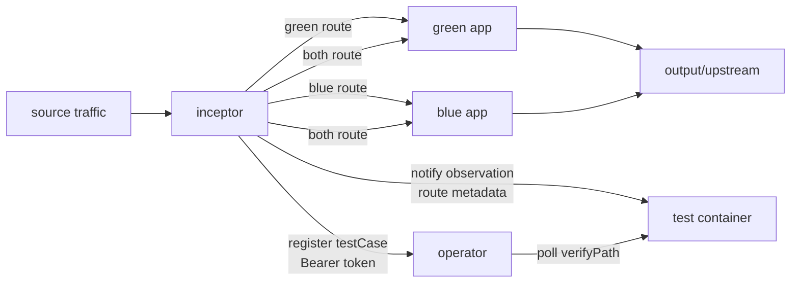
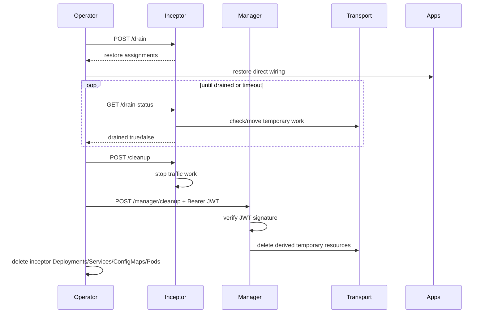

# Plugin Architecture

FluidBG plugins are split into two roles when privileged infrastructure control
is required:

- **Manager:** long-running control-plane process in the operator namespace.
- **Inceptor:** per-inception traffic process in the application namespace.

HTTP does not currently need a manager because it does not create privileged
external infrastructure. RabbitMQ and Azure Service Bus can use managers because
queue create/delete credentials must not be handed to application namespaces.

## Component Model

## Trust Boundary

The application namespace is not trusted with infrastructure-admin credentials.
An attacker who can edit a `BlueGreenDeployment` in that namespace must not be
able to create or delete arbitrary queues by choosing matching names.

Manager rules:

- Verify the JWT signature using the operator signing key.
- Trust `namespace`, `blueGreenRef`, `inceptionPoint`, and `plugin` only from
  token claims.
- Recompute derived temporary resource names from claims and active role names.
- Never trust BGD-provided temporary queue names for create/delete authority.

Inceptor rules:

- Receive `FLUIDBG_PLUGIN_AUTH_TOKEN`, not the signing key.
- Require incoming operator calls to use the same bearer token value.
- Use `FLUIDBG_INCEPTOR_INFRA_DISABLED=true` to skip privileged create/delete
  operations when a manager is configured.
- Move traffic and perform observation using the secured config emitted by the
  operator.

## Prepare Flow

## Traffic Flow

Route metadata is plugin-owned. Applications do not need to put route fields in
message bodies or HTTP payloads. A duplicator reports `both`; a splitter reports
`green` or `blue`; a combiner derives route from the source queue or endpoint.

## Drain And Cleanup Flow

RabbitMQ drain waits for temporary queues to be empty and for input queues to
have no active consumers before cleanup. Azure Service Bus uses a stability
window because locked messages can become visible again after the lock expires.
If the configured drain timeout is exceeded, the operator records
`TimedOutMaybeSuccessful` instead of silently treating the drain as safe.

## Built-In Plugin Matrix

| Plugin | Manager | Inceptor | Progressive | Notes |
|---|---|---|---|---|
| HTTP | Not used | Combined splitter/observer/mock/writer service | Yes | No external resource-admin secret is needed. |
| RabbitMQ | Optional, recommended | Duplicator/splitter/combiner/observer/writer/consumer | Yes | Manager owns temp queue create/delete; inceptor moves messages. |
| Azure Service Bus | Optional, recommended | Duplicator/splitter/combiner/observer/writer/consumer | Yes | Manager supports connection string and workload identity modes. |

