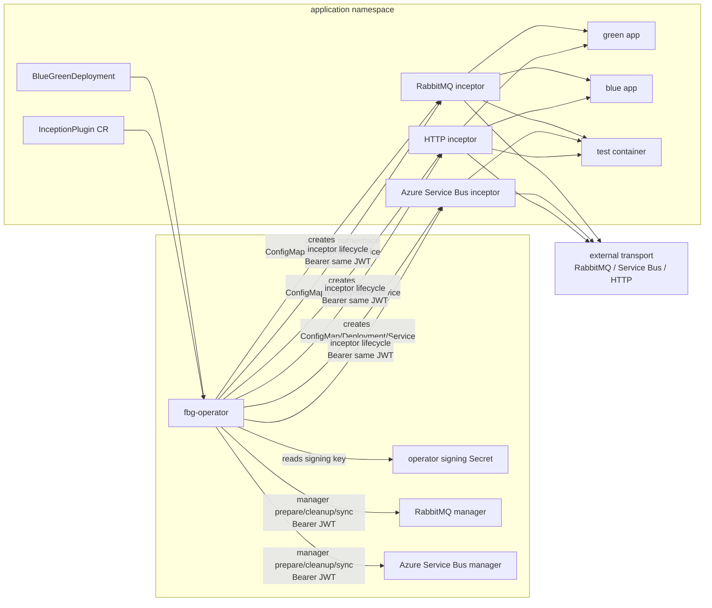
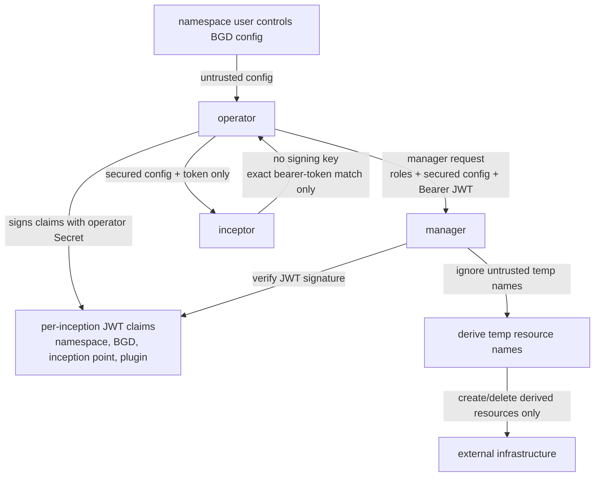
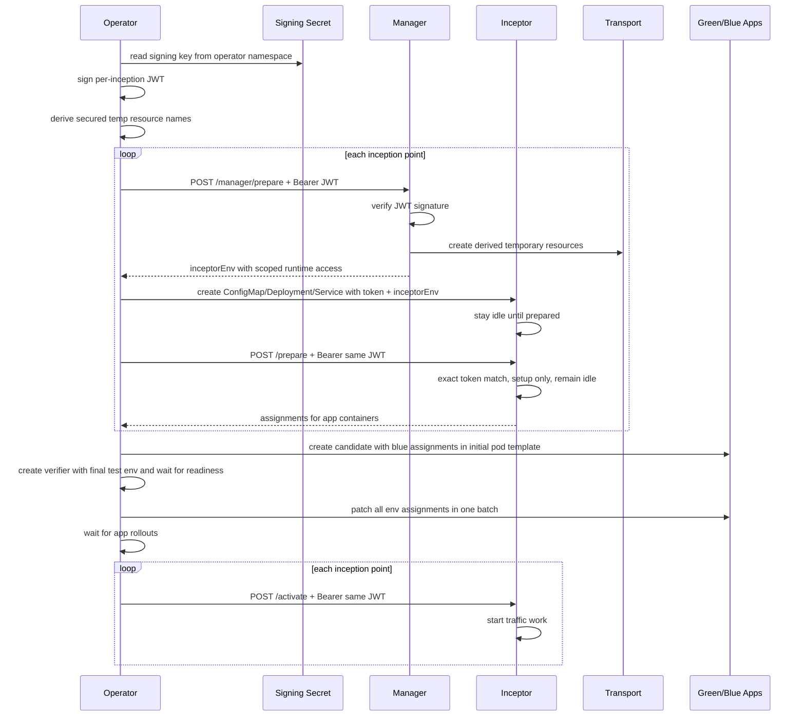
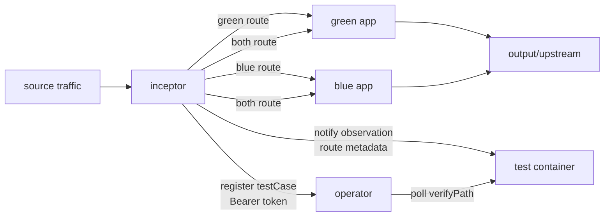
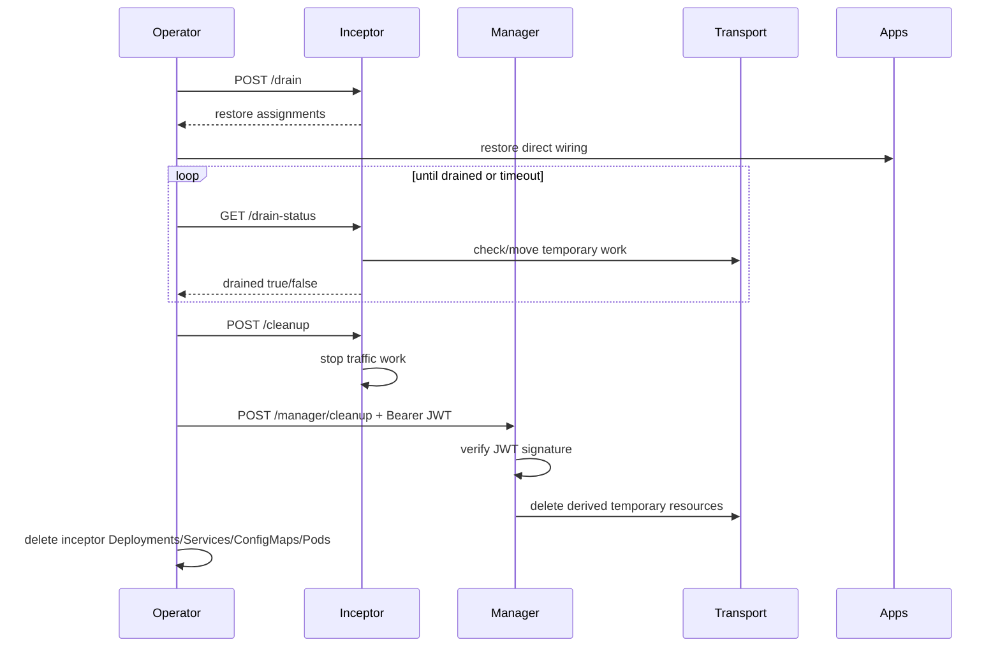
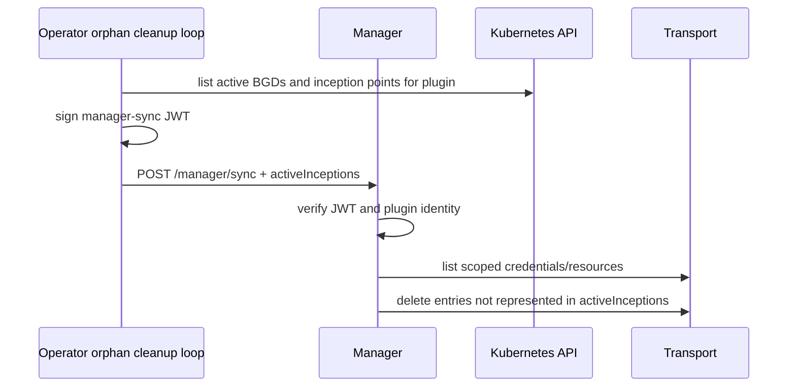

# Plugin Architecture

FluidBG plugins are split into two roles when privileged infrastructure control
is required:

- **Manager:** long-running control-plane process in the operator namespace.
- **Inceptor:** per-inception traffic process in the application namespace.

HTTP does not currently need a manager because it does not create privileged
external infrastructure. RabbitMQ and Azure Service Bus can use managers because
queue create/delete credentials must not be handed to application namespaces.

## Component Model

## Trust Boundary

The application namespace is not trusted with infrastructure-admin credentials.
An attacker who can edit a `BlueGreenDeployment` in that namespace must not be
able to create or delete arbitrary queues by choosing matching names.

Manager rules:

- Verify the JWT signature using the operator signing key.
- Trust `namespace`, `blueGreenRef`, `inceptionPoint`, and `plugin` only from
  token claims.
- Recompute derived temporary resource names from claims and active role names.
  Queue-style names include namespace, BGD name, BGD UID, inception point, role,
  and logical purpose so recreated BGDs and concurrent BGDs cannot collide.
- Never trust BGD-provided temporary queue names for create/delete authority.
- Return inceptor runtime environment only from authenticated manager prepare.
  The operator injects those values before creating the inceptor pod.
- Implement `syncPath` so the operator can periodically send the active
  inception inventory. Managers use that inventory to delete scoped credentials
  and plugin-owned temporary resources that missed normal cleanup because a
  manager or operator died at the wrong time.

Inceptor rules:

- Receive `FLUIDBG_PLUGIN_AUTH_TOKEN`, not the signing key.
- Require incoming operator calls to use the same bearer token value.
- Start idle and do not move traffic until the operator calls `activatePath`.
- Treat `preparePath` as setup and assignment discovery only. It must not
  consume from base queues, proxy HTTP calls, notify verifiers, register cases,
  or write output.
- Use `FLUIDBG_INCEPTOR_INFRA_DISABLED=true` to skip privileged create/delete
  operations when a manager is configured.
- Move traffic and perform observation using the secured config emitted by the
  operator.

## Prepare Flow

The operator intentionally batches app assignment patches after all inception
points have been prepared, then activates inceptors only after the app rollouts
are ready. This avoids partial wiring such as input traffic being redirected
while the same app still publishes to an old output queue.

## Traffic Flow

Route metadata is plugin-owned. Applications do not need to put route fields in
message bodies or HTTP payloads. A duplicator reports `both`; a splitter reports
`green` or `blue`; a combiner derives route from the source queue or endpoint.

## Drain And Cleanup Flow

## Manager Sync

The sync request contains the active namespace, BGD name, BGD UID, inception
point, roles, and BGD plugin config. It deliberately does not contain privileged
transport credentials. Managers recompute derived temporary names from that
inventory and remove only resources with FluidBG-owned prefixes that are absent
from the active set.

Plugin-specific drain and failure details are intentionally documented once in
the built-in plugin references: [RabbitMQ](plugins/rabbitmq.md), [Azure Service
Bus](plugins/azure-servicebus.md), and [HTTP](plugins/http.md).

## Built-In Plugin Matrix

| Plugin | Manager | Inceptor | Progressive | Notes |
|---|---|---|---|---|
| HTTP | Not used | Combined splitter/observer/mock/writer service | Yes | No external resource-admin secret is needed. |
| RabbitMQ | Optional, recommended | Duplicator/splitter/combiner/observer/writer/consumer | Yes | Manager owns temp queue create/delete; inceptor moves messages. |
| Azure Service Bus | Optional, recommended | Duplicator/splitter/combiner/observer/writer/consumer | Yes | Manager supports connection string and workload identity modes. |
