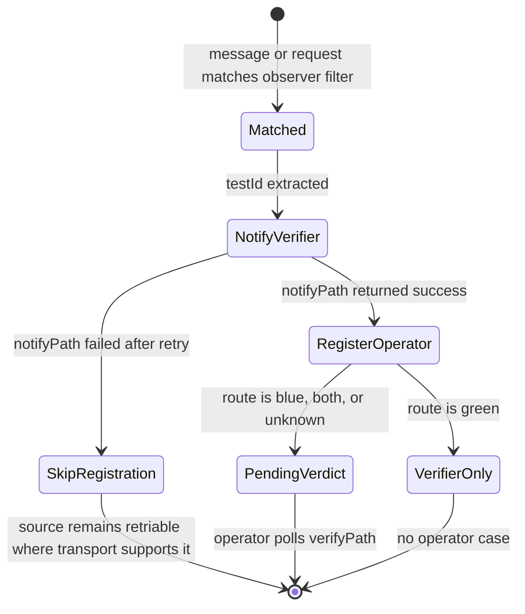
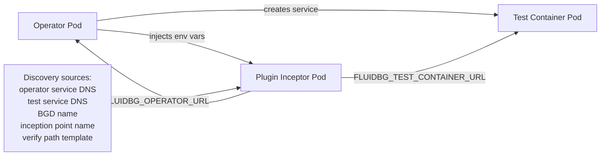
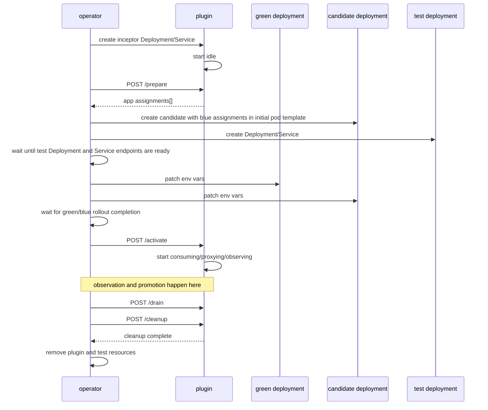
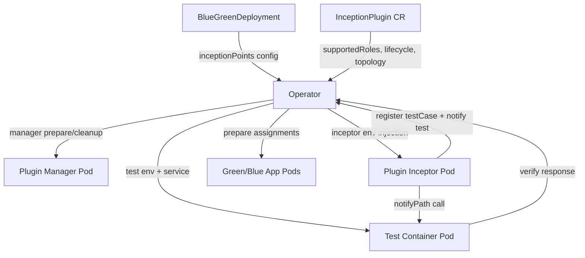

# Plugin Interface

This document describes the plugin contract between:

- the operator
- plugin managers
- standalone plugin inceptors
- the test container
- the application deployments

It focuses on how plugins discover the other components, which HTTP calls are expected, and which values are injected by the operator.

## Overview

The operator does not hardcode transport behavior. A plugin is registered as an `InceptionPlugin` CR and selected by an `InceptionPoint` in a `BlueGreenDeployment`.

At runtime the operator is responsible for:

1. creating the per-inception inceptor Deployment and Service
2. calling manager and inceptor lifecycle endpoints
3. patching green, blue, and test deployments with plugin-provided assignments
4. injecting runtime URLs and identity into the inceptor container
5. cleaning up inceptor and test resources after promotion or rollback

The plugin is responsible for:

1. privileged transport setup/cleanup in the manager when one is configured
2. traffic movement, observation, and test notification in the inceptor
3. observing, duplicating, splitting, combining, writing, or consuming traffic according to its active roles
4. registering `testCase`s with the operator when observation says a test-relevant event happened
5. notifying the test container when configured to do so

## Control Plane Contract

### Versioned SDK Contract

The plugin wire contract is versioned separately from plugin implementations:

| Contract | Version | Source |
|---|---|---|
| Plugin API | `fluidbg.plugin/v1alpha1` | `sdk/spec/plugin-api-v1alpha1.openapi.yaml` |
| Kubernetes CRDs | `fluidbg.io/v1alpha1` | `sdk/spec/crd-versions.yaml` |
| Rust SDK crate | `fluidbg-plugin-sdk` | `sdk/rust` |

Rust plugins should use `fluidbg-plugin-sdk` for shared lifecycle, assignment,
filter, selector, route, observation, and test registration models. Non-Rust
plugins should generate clients or server stubs from the OpenAPI spec so all
SDKs keep the same JSON shapes and endpoint semantics.

### InceptionPlugin CRD

An `InceptionPlugin` declares:

- `supportedRoles`
- `topology`
- `inceptor`
- optional `manager`
- `lifecycle.preparePath`
- `lifecycle.activatePath`
- `lifecycle.cleanupPath`
- `manager.syncPath`
- `configSchema`
- `fieldNamespaces`
- `features`

For the built-in RabbitMQ and Azure Service Bus plugins the important roles are:

- `duplicator`
- `splitter`
- `combiner`
- `observer`
- `writer`
- `consumer`

Only `topology: standalone` is part of the CRD and supported by the operator
lifecycle.

### InceptionPoint

An `InceptionPoint` activates one or more roles on one plugin instance and provides transport-specific config.

Example:

```yaml
inceptionPoints:
  - name: incoming-orders
    pluginRef:
      name: rabbitmq
    roles: [duplicator, observer]
    config:
      duplicator:
        inputQueue: orders
        greenInputQueue: orders-green
        blueInputQueue: orders-blue
        greenInputQueueEnvVar: INPUT_QUEUE
        blueInputQueueEnvVar: INPUT_QUEUE
      observer:
        testId:
          field: queue.body
          jsonPath: $.orderId
        match:
          - field: queue.body
            jsonPath: $.type
            matches: "^order$"
        notifyPath: /observe/{testId}/incoming-orders
```

For queue-style built-in plugins, user-supplied temporary queue fields describe
intent only. The operator and plugin manager rewrite temporary queue names to
derived names scoped by namespace, BGD name, BGD UID, inception point, role, and
logical purpose before any create/delete operation or inceptor assignment.

## Inceptor Discovery

The inceptor does not guess where the operator or test container are. The operator injects those values.

### Injected Inceptor Environment

For standalone inceptors the operator injects:

- `FLUIDBG_OPERATOR_URL`
  - example: `http://fluidbg-operator.fluidbg-system:8090`
- `FLUIDBG_TESTCASE_REGISTRATION_URL`
  - example: `http://fluidbg-operator.fluidbg-system:8090/testcases`
- `FLUIDBG_TEST_CONTAINER_URL`
  - example: `http://test-container.fluidbg-test:8080`
- `FLUIDBG_TESTCASE_VERIFY_PATH_TEMPLATE`
  - example: `/result/{testId}`
- `FLUIDBG_INCEPTION_POINT`
  - example: `incoming-orders`
- `FLUIDBG_BLUE_GREEN_REF`
  - example: `order-processor-bootstrap`
- `FLUIDBG_ACTIVE_ROLES`
  - example: `duplicator,observer`
- `FLUIDBG_CONFIG_PATH`
  - example: `/etc/fluidbg/config.yaml`
- `FLUIDBG_PLUGIN_AUTH_TOKEN`
  - per-inception JWT signed by the operator
- `FLUIDBG_INCEPTOR_INFRA_DISABLED`
  - `true` when a manager owns privileged resource setup/cleanup for this inception point

Standalone env injection templates can also reference operator-provided template
context values such as `{{pluginServiceName}}`, `{{pluginDeploymentName}}`,
`{{inceptionPoint}}`, `{{blueGreenRef}}`, and `{{namespace}}`. Built-in HTTP
uses `{{pluginServiceName}}` so both blue and test containers can call the same
combined HTTP plugin service.

The inceptor gets the full operator and test-container base URLs from env injection, not from hardcoded names inside the plugin itself.

## Operator and Plugin Authentication

The operator uses a user-selected Kubernetes Secret as its JWT signing key. The
Secret name and key are configured with:

- `FLUIDBG_AUTH_SIGNING_SECRET_NAMESPACE`
- `FLUIDBG_AUTH_SIGNING_SECRET_NAME`
- `FLUIDBG_AUTH_SIGNING_SECRET_KEY`

The signing Secret belongs in the operator namespace, not in application
namespaces. Inceptors never receive this key. They receive only
`FLUIDBG_PLUGIN_AUTH_TOKEN` and validate incoming operator calls by requiring the
same bearer token value.

For each inception point the operator signs one JWT and injects it as
`FLUIDBG_PLUGIN_AUTH_TOKEN`. The token claims identify the caller:

| Claim | Meaning |
|---|---|
| `iss` | Fixed issuer: `fluidbg-operator` |
| `aud` | Fixed audience: `fluidbg-inception-plugin` |
| `namespace` | Namespace of the concrete `BlueGreenDeployment` that owns this inception point |
| `blue_green_ref` | `BlueGreenDeployment.metadata.name` |
| `blue_green_uid` | `BlueGreenDeployment.metadata.uid` for this concrete rollout CR |
| `inception_point` | `InceptionPoint.name` |
| `plugin` | `InceptionPlugin.metadata.name` |

The same token is used in both directions:

- Operator to inceptor lifecycle calls set `Authorization: Bearer <token>`.
- Inceptor lifecycle endpoints do not verify signatures and do not know the
  signing key; they reject requests whose bearer token does not exactly match
  `FLUIDBG_PLUGIN_AUTH_TOKEN`.
- Operator to manager lifecycle calls set `Authorization: Bearer <token>`.
- Managers verify the JWT signature with the operator signing key and derive
  namespace, BGD, inception point, and plugin identity from token claims.
- Inceptor to operator `/testcases` calls set `Authorization: Bearer <token>`.
- The operator verifies the JWT signature and then derives the caller identity
  from claims. It rejects `/testcases` if the body `blue_green_ref` or
  `inception_point` differs from the verified token claims.
- The operator also checks that `blue_green_uid` still matches a live,
  non-terminal BGD before accepting a registration. This keeps late callbacks
  from a cleaned-up inceptor from recreating store rows or attaching to a new
  BGD that reused the same name.

Only the signing Secret is long-lived. Per-inception JWTs are generated by the
operator and injected into inceptor pods; they are not written to the state store.
Temporary inceptor Deployments, Services, ConfigMaps, Pods, and legacy
per-inception auth Secrets are deleted after promotion, rollback, or rollout
restart cleanup. The selected operator signing Secret is user-owned and is not
deleted by rollout cleanup.

### How URLs Are Built

- The operator URL is a cluster service in `fluidbg-system`.
- The test container URL is namespace-qualified:
  - `http://<generated-test-service>.<bgd-namespace>:<first-service-port>`
- The verify URL for each `testCase` is built by the plugin from:
  - `FLUIDBG_TEST_CONTAINER_URL`
  - `FLUIDBG_TESTCASE_VERIFY_PATH_TEMPLATE`

Example:

- base: `http://test-container.fluidbg-test:8080`
- verify path template: `/result/{testId}`
- final verify URL for `order-17`:
  - `http://test-container.fluidbg-test:8080/result/order-17`

## Lifecycle Endpoints

### `POST /prepare`

Called by the operator before observation starts.

Purpose:

- create transport-specific derived resources
- return property assignments for green and blue application targets

Plugins must not return `target: test` assignments from runtime `prepare`
responses. Test-container assignments must be declared in
`InceptionPlugin.spec.injects.testContainer`; the operator renders those values
into the verifier Deployment before creating the verifier pod. This prevents a
verifier Deployment rollout while observations are already possible.

Response shape:

```json
{
  "assignments": [
    {
      "target": "green",
      "kind": "env",
      "name": "INPUT_QUEUE",
      "value": "orders-green"
    },
    {
      "target": "blue",
      "kind": "env",
      "name": "INPUT_QUEUE",
      "value": "orders-blue"
    }
  ]
}
```

Assignment fields:

| Field | Values | Meaning |
|---|---|---|
| `target` | `green`, `blue` for runtime prepare; `test` only for plugin-declared template injection | Deployment group the operator patches |
| `kind` | `env` | Assignment type; only environment variables are currently supported |
| `name` | string | Environment variable name |
| `value` | string | Environment variable value |
| `containerName` | optional string | Patch only this container when set; otherwise patch every container in the target Deployment |

### `POST /drain`

Called when a promotion or rollback decision has been made, before terminal cleanup.

Purpose:

- stop accepting new work on temporary paths
- return assignments that move the surviving deployment back toward direct production wiring
- give the plugin time to let temporary queues, streams, or proxies drain

`/drain` is an admission barrier. After a plugin returns success from this
endpoint, it must not accept new work into temporary/proxied paths for that
inception point. `/drain-status` may only report work that was already admitted
before the barrier or broker state that is still visible to the plugin.

Drain operations must be active and idempotent. A plugin must not rely on a
background worker eventually noticing drain mode for correctness; `/drain` and
subsequent `/drain-status` calls should themselves retry safe drain work, such
as moving temporary queue, shadow queue, or dead-letter messages back to their
base resources before reporting completion.

The response shape is the same as `/prepare`.

### `GET /drain-status`

Called repeatedly while the `BlueGreenDeployment` is in `Draining`.

Response shape:

```json
{
  "drained": true,
  "message": "temporary input queues have no ready or unacknowledged messages"
}
```

If a plugin does not expose `drainStatusPath`, the operator treats that inception point as drain-complete. If the configured maximum drain wait elapses first, the operator records `TimedOutMaybeSuccessful` and proceeds with cleanup.

### `POST /cleanup`

Called by the operator after `Completed` or `RolledBack`.

Purpose:

- delete transport-specific derived resources
- allow the operator to restore direct application wiring cleanly
- leave the plugin safe to idle or terminate

## Data Verification Contract

The plugin creates and notifies `testCase`s, but the final green/not-green decision still comes from the test container verify endpoint.

### Expected verify response

The operator expects JSON shaped like:

```json
{
  "passed": true,
  "testId": "order-17",
  "errorMessage": null
}
```

or on failure:

```json
{
  "passed": false,
  "testId": "order-17",
  "errorMessage": "downstream validation failed"
}
```

If the test is still in progress:

```json
{
  "passed": null,
  "testId": "order-17",
  "status": "observing",
  "errorMessage": null
}
```

## Observer Notification Body

`observer.notifyPath` is a single callback endpoint. Plugins include route metadata in the JSON body so the test container can distinguish mirrored traffic from weighted splitter traffic without requiring separate URLs. Route metadata is plugin-owned infrastructure metadata; applications do not need to add route fields to their business payloads.

Notification shape:

```json
{
  "testId": "order-17",
  "inceptionPoint": "incoming-orders",
  "route": "blue",
  "payload": {}
}
```

`route` values:

| Value | Meaning |
|---|---|
| `blue` | The resource was routed only to the candidate path. |
| `green` | The resource was routed only to the current green path. |
| `both` | The resource was duplicated to both green and blue. This is the queue `duplicator` behavior. |
| `unknown` | The plugin cannot determine the route for this observation. |

For RabbitMQ and Azure Service Bus, input routes come from the duplicator/splitter decision. Output routes come from the combiner source queue: `blueOutputQueue` maps to `blue`, and `greenOutputQueue` maps to `green`.

Queue plugin operator registration semantics:

- `blue`, `both`, and `unknown` observations register an operator `testCase`.
- `green` observations still call `observer.notifyPath`, but do not register an operator `testCase`; this prevents progressive splitter traffic sent only to green from becoming pending blue verification cases.
- Plugins must deliver `observer.notifyPath` before registering the operator `testCase`. If the verifier callback cannot be delivered after retry, the plugin must not register that case with the operator. This prevents a rollout from being promoted from operator-local counts when the verifier never observed the actual side effect.

HTTP operator registration follows the same route semantics. Splitter/proxy
requests routed to blue register operator `testCase`s; green-only progressive
traffic can still be observed by the test container without creating pending
blue verification cases.

### Observer State Machine

Every observer role uses the same delivery state machine:



Correct behavior by failure point:

| Failure point | Plugin behavior | Operator behavior |
|---|---|---|
| Filter does not match or no `testId` can be extracted | Do not notify and do not register. Continue normal transport handling. | No test case is created. |
| `observer.notifyPath` fails after retry | Do not register the operator case. Queue plugins avoid acknowledging or completing the source message when possible so the transport can redeliver. | No false pass count is created. The rollout waits for other cases or eventually times out/rolls back according to promotion policy. |
| Operator `/testcases` registration fails after verifier notification succeeded | Log the registration failure. Queue plugins may redeliver depending on transport failure handling. | No case count is created until a registration succeeds. |
| `verifyPath` keeps returning `passed: null` | The plugin is done; verifier state remains pending. | The case stays pending until its timeout, then counts as timed out and can trigger rollback. |
| `verifyPath` returns `passed: false` | The plugin is done. | The case counts as failed and rollback can be selected when the promotion threshold is no longer recoverable. |

## Communication Diagrams

### 1. Inceptor Discovery



### 2. Queue-Driven Rollout with Duplicator + Observer + Combiner


### 3. Prepare, Activate, and Cleanup



The operator calls plugin `preparePath` before verifier creation and before
application assignment rollout. Therefore `preparePath` is a non-traffic setup
phase: queue plugins may declare temporary queues and return app assignments,
but must not consume from base queues; HTTP plugins must not accept proxy/write
traffic. Traffic work starts only after the operator has created the candidate
with blue assignments in its initial pod template, created the verifier, waited
for verifier readiness and Service endpoints, patched green/blue app
assignments, waited for those rollouts, and called `activatePath`.

Plugins must not return test-deployment assignments from `preparePath`. Those
assignments arrive too late to be part of the initial verifier pod template and
the operator rejects them. Put test-container injections in the plugin CRD
`injects` section instead. Plugins must also not return assignments from
`activatePath`; activation is only a state transition.

Managers may expose `manager.syncPath` (default `/manager/sync`). The operator
calls it from the orphan-cleanup loop with an authenticated active-inception
inventory. The inventory includes namespace, BGD name, BGD UID, inception point,
roles, and non-secret BGD plugin config for every active BGD using that plugin.
Managers use it to garbage-collect scoped credentials and FluidBG-owned
temporary resources that are no longer represented by live BGDs.

### 4. Information Sources by Container



## Built-In Plugin References

Plugin-specific role behavior, configuration, state machines, failure behavior,
and drain semantics live in the built-in plugin reference pages:

| Plugin | Reference |
|---|---|
| `rabbitmq` | [RabbitMQ Plugin](plugins/rabbitmq.md) |
| `azure-servicebus` | [Azure Service Bus Plugin](plugins/azure-servicebus.md) |
| `http` | [HTTP Plugin](plugins/http.md) |

## Practical Notes

- Standalone plugins and the test container are temporary rollout resources.
- Service discovery must be namespace-qualified when the caller is outside the test namespace.
- `testCasesObserved` only counts finalized cases.
- `testCasesPending` must be included when you want to know whether the operator has started tracking traffic already.
