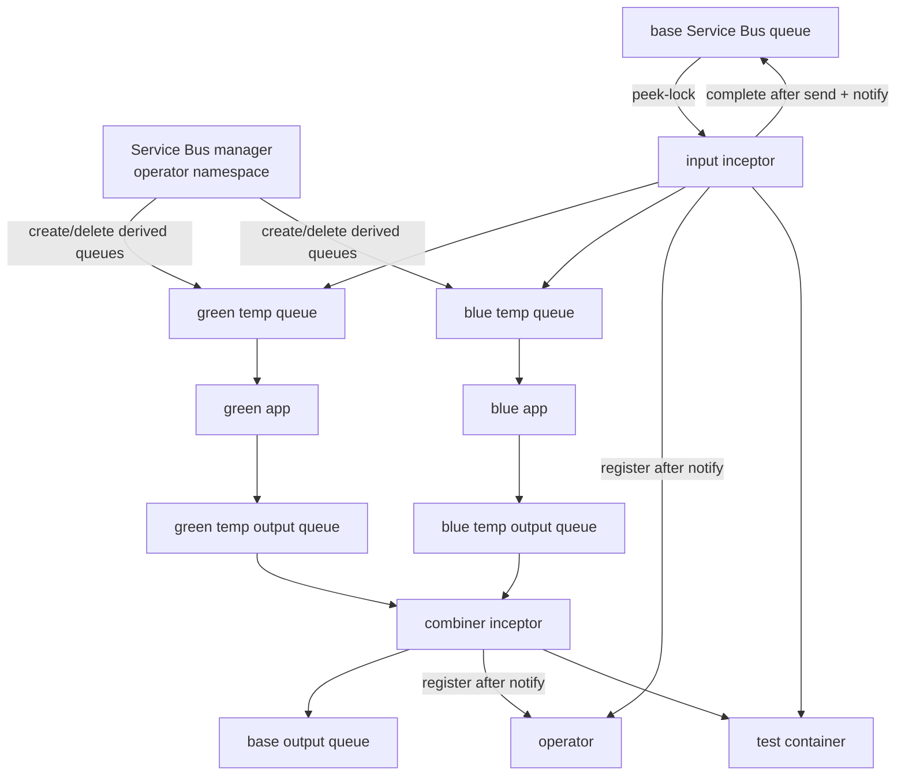
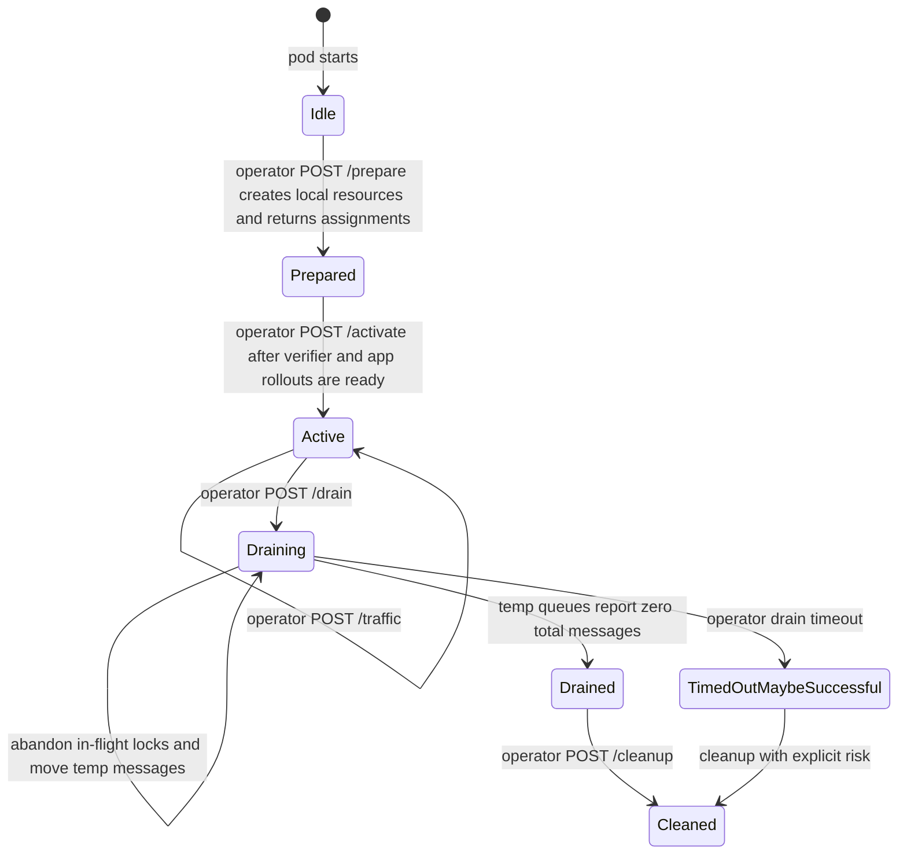
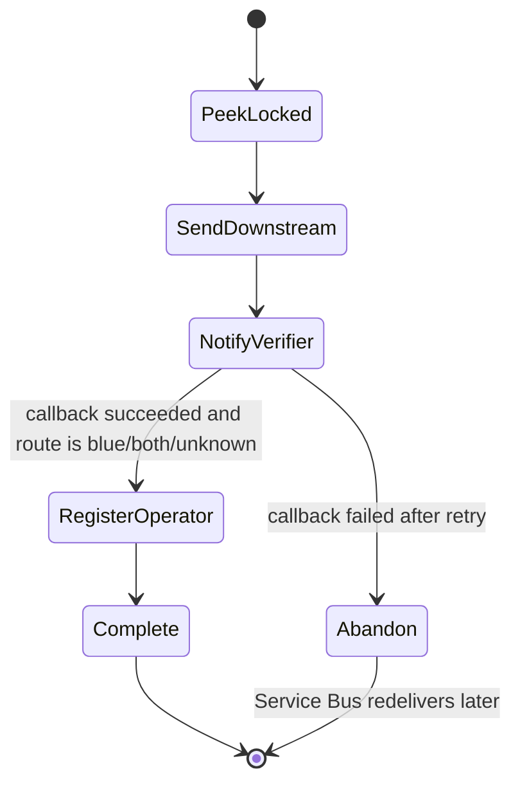

# Azure Service Bus Plugin

## Identity And Topology

| Field | Value |
|---|---|
| Built-in plugin name | `azure-servicebus` |
| Image | `ghcr.io/dlahmad/fbg-plugin-azure-servicebus` |
| Supported roles | `duplicator`, `splitter`, `combiner`, `observer`, `writer`, `consumer` |
| Progressive shifting | Supported for `splitter` |
| Manager mode | Supported and recommended |

The Azure Service Bus plugin mirrors the RabbitMQ queue-role model where Service
Bus semantics map cleanly. The manager should run in the operator namespace and
hold connection-string or workload-identity permissions for queue management.
Per-inception inceptors run in application namespaces and should not receive
queue management credentials. With connection-string manager auth, inceptors
receive short-lived queue-scoped SAS tokens instead of the base connection
string.

## Configuration Reference

Top-level fields:

| Field | Required | Used By | Meaning |
|---|---|---|---|
| `queueDeclaration` | no | manager | Service Bus queue properties for derived temporary queues. |
| `shadowQueue` | no | manager, drain | Optional separate queue next to each temporary queue. |
| `duplicator` | when role active | `duplicator` | Base input and green/blue input queue names plus env vars to patch. |
| `splitter` | when role active | `splitter` | Base input and green/blue input queue names plus env vars to patch. |
| `combiner` | when role active | `combiner` | Green/blue output queue names, base output queue, and env vars to patch. |
| `writer` | when role active | `writer` | Target queue for `/write`. |
| `consumer` | when role active | `consumer` | Input queue for consumer-style reads. |
| `observer` | when role active | `observer` | Test id selector, match filters, and verifier callback path. |

`queueDeclaration` supports Service Bus properties including lock duration,
max delivery count, TTL, dead-letter-on-expiration, duplicate detection,
sessions, partitioning, forwarding, and entity status. The plugin does not
implicitly set forwarding or dead-letter properties.

`duplicator`, `splitter`, and `combiner` may set
`temporaryQueueIdentifier` to a semantic value up to 40 characters using
letters, digits, `.`, `_`, or `-`. The SDK converts it to a fixed 10-character
safe token before including it in derived temporary queue names, for example
`fluidbg-green-in-incomiada9-<hash>`. Generated queue names remain within the
plugin's 63-character bound while still letting operators identify which base
queue or inception point owns a temporary queue without embedding long or
sensitive names.

`shadowQueue.suffix` is preserved after validation. For short names it is
appended directly. For already-long generated temporary names it is inserted
before the stable hash suffix so the resulting queue name stays bounded and
still cannot collide. `shadowQueue.queueDeclaration` configures shadow queues
independently.

## Authentication

| Mode | Required Input | Notes |
|---|---|---|
| Connection string | manager Secret with `AZURE_SERVICEBUS_CONNECTION_STRING` | Manager creates queues and returns short-lived per-queue SAS tokens to the inceptor. |
| Workload identity | manager/inceptor runtime env `AZURE_SERVICEBUS_NAMESPACE` plus projected AKS workload identity env vars | Exchanges the Kubernetes service account token for Microsoft Entra tokens. |

Service Bus authentication and ARM management settings are never valid BGD
config. They are plugin installation/runtime configuration. Helm injects them
from Secrets and workload identity ServiceAccounts into manager and inceptor
pods; BGD authors only describe queue names, queue properties, role behavior,
and verifier matching.

For workload identity, the manager requests Service Bus data-plane tokens for
`https://servicebus.azure.net/.default`. If ARM queue management is used, it
also uses `https://management.azure.com/.default`. The manager service account
must be configured by the cluster owner with the appropriate Azure Workload
Identity labels/annotations and Azure permissions.

## Role Behavior

| Role | Behavior | Assignments |
|---|---|---|
| `duplicator` | Peek-locks from `duplicator.inputQueue`, sends every message to green and blue temporary queues, then completes the source message. Observer filters affect only verification callbacks, never message routing. Route metadata is `both`. | Patches green and blue input queue env vars. |
| `splitter` | Peek-locks from `splitter.inputQueue` and sends every message to green or blue based on current traffic percentage. Observer filters affect only verification callbacks, never message routing. | Patches green and blue input queue env vars. |
| `combiner` | Reads green and blue output queues, sends to `combiner.outputQueue`, and derives route metadata from the source queue. | Patches green and blue output queue env vars. |
| `observer` | Applies filters, extracts `testId`, posts `observer.notifyPath`, then registers operator cases for `blue`, `both`, and `unknown` routes. | None. |
| `writer` | Exposes `/write` and sends the supplied JSON payload plus custom properties to `writer.targetQueue`. | Test-container env injection can point callers to the writer service. |
| `consumer` | Consumes from `consumer.inputQueue` for plugin-driven read flows. | None. |

The plugin preserves body, custom application properties, and sendable
`BrokerProperties` such as message id, correlation id, session id, content type,
TTL, and partition keys. It drops read-only receive metadata such as lock token,
sequence number, delivery count, lock expiry, and dead-letter reason.

## Runtime State Machine

Observer sub-state:

## Failure Behavior

| Situation | Behavior |
|---|---|
| Queue creation fails | `prepare` fails; the operator retries reconciliation and does not activate the rollout. |
| Verifier readiness is slow or app rollout is still updating | The plugin stays `Prepared`/idle and does not peek-lock base queue messages. Existing green traffic continues through the old wiring. |
| `activate` is not called | The inceptor remains idle even if its pod and temporary queues exist. |
| Downstream send fails | The peek-locked source message is abandoned or left to unlock so Service Bus can redeliver. |
| Verifier notification fails after retry | The operator case is not registered and the message is abandoned/unlocked where the role owns a lock. |
| Operator registration fails after verifier notification | The plugin logs the error. The case is not counted until a later registration succeeds. |
| Green-only progressive observation | The verifier may be notified, but no operator case is registered. |
| Message is dead-lettered in a temporary queue | Drain copies temporary `$deadletterqueue` messages back to the corresponding base queue path before temporary queue deletion. |
| Drain timeout | The operator records `TimedOutMaybeSuccessful` and proceeds with cleanup. |

## Drain And Cleanup

Before activation the plugin never peek-locks from base queues. During drain,
input roles stop taking new base-queue work and move available
messages from temporary green/blue queues back to the base queue. They also read
temporary `$deadletterqueue` subqueues and republish those messages to the base
queue before completing the DLQ messages.

If a shadow queue is configured, temporary shadow queue messages and their own
`$deadletterqueue` messages move back to the matching base shadow queue, not the
regular base queue. Combiner roles move temporary output queue messages and
temporary output DLQ messages back to the base output queue.

Drain status reports success only after temporary queues report zero total
messages and the plugin has no plugin-owned locked messages in flight. With ARM
status, `properties.messageCount` is used so locked messages still present in
the entity keep drain pending.

Temporary queue names expose only route/purpose plus a stable hash, for example
`fluidbg-green-in-<hash>` or `fluidbg-blue-out-<hash>`. The hash input includes
namespace, BGD name, BGD UID, inception point, role, and logical queue purpose,
but those values are not exposed in the queue name.

Cleanup deletes only derived queue names recomputed from token claims and active
roles. Derived names include namespace, BGD name, BGD UID, inception point, role,
and logical queue purpose. User-supplied queue names are not trusted for manager
cleanup. The manager also supports `/manager/sync`; the operator periodically
sends the active inception inventory so the manager can remove FluidBG-owned
temporary Service Bus queues that missed normal cleanup. Connection-string
inceptor credentials are short-lived SAS tokens, so missed credential cleanup
expires naturally.

## Security Boundary

The manager verifies the per-inception JWT and derives namespace, BGD,
inception point, and plugin identity from claims. Privileged Azure management
credentials belong on the manager. Per-inception inceptors may receive
least-privilege data-plane credentials or workload identity bindings needed to
read/write their assigned queues, but those credentials are plugin installation
config, never BGD config. This prevents application namespaces from receiving
broad queue-management privileges through a BGD.

For connection-string auth, provide
`builtinPlugins.azureServiceBus.manager.connectionStringSecretName` in Helm.
For workload identity, provide the manager ServiceAccount and Azure Workload
Identity annotations. The chart does not embed Azure Service Bus credentials
directly into manager Deployment env vars. The manager may return
`AZURE_SERVICEBUS_NAMESPACE`, `FLUIDBG_AZURE_SERVICEBUS_AUTH_MODE`, and
`FLUIDBG_AZURE_SERVICEBUS_SAS_TOKENS_JSON` as authenticated `inceptorEnv`; the
base connection string remains manager-only.
