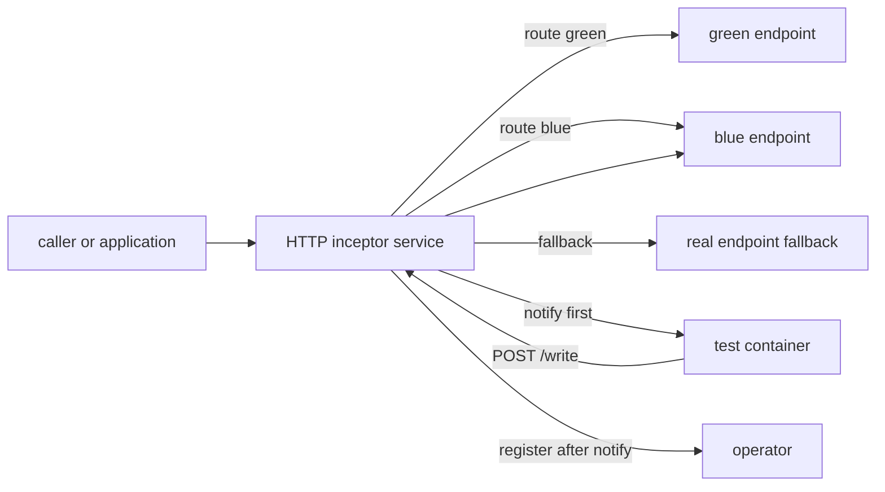
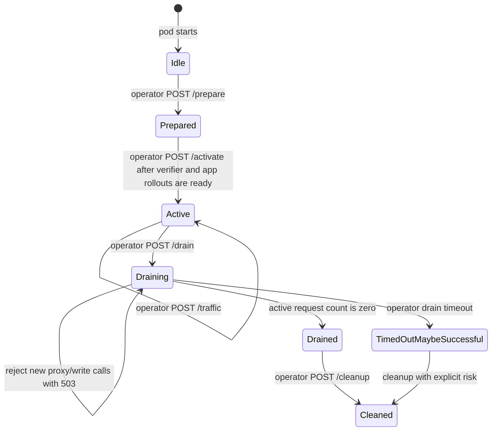
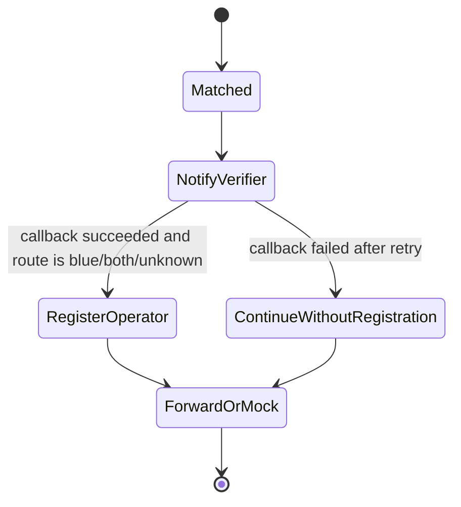

# HTTP Plugin

## Identity And Topology

| Field | Value |
|---|---|
| Built-in plugin name | `http` |
| Image | `ghcr.io/dlahmad/fbg-plugin-http` |
| Supported roles | `splitter`, `observer`, `mock`, `writer` |
| Progressive shifting | Supported for `splitter` |
| Manager mode | Not used |

The HTTP plugin is a single standalone inceptor service. It does not need an
external infrastructure manager because it does not create broker resources.

## Configuration Reference

| Field | Required | Used By | Meaning |
|---|---|---|---|
| `port` | no | all roles | Inceptor listen port. Defaults to `9090`. |
| `realEndpoint` | proxy/write fallback | splitter, observer, mock, writer | Default upstream target. Supports `{testContainerUrl}` template replacement. |
| `greenEndpoint` | splitter | splitter | Explicit green route target. Falls back to `realEndpoint`. |
| `blueEndpoint` | splitter | splitter | Explicit blue route target. Falls back to `realEndpoint`. |
| `targetUrl` | writer | writer | Explicit `/write` target. Falls back to `realEndpoint`. |
| `envVarName` | no | operator assignments | Application env var patched to route calls through the plugin service. |
| `writeEnvVar` | no | operator assignments | Test-container env var patched with the plugin `/write` URL. |
| `testId` | observer/mock registration | observer, mock | Selector used to extract a test id from body, path, header, or static value. |
| `match` | no | observer, mock | Root filter set. All conditions must match. |
| `filters` | no | observer, mock | Filter-specific `notifyPath` and payload selection. |
| `ingress` / `egress` | no | future-compatible config | Directional filter grouping. |

`realEndpoint`, `greenEndpoint`, `blueEndpoint`, and `targetUrl` can reference
`{testContainerUrl}` or `{{testContainerUrl}}` when the endpoint should point at
the test container created for the rollout.

## Role Behavior

| Role | Behavior | Assignments |
|---|---|---|
| `splitter` | Proxies requests and routes to green or blue based on current traffic percentage. | Patches `envVarName` so the application calls the plugin service. |
| `observer` | Filters requests, extracts `testId`, posts `notifyPath`, then registers blue/both/unknown cases with the operator. | None. |
| `mock` | For matched requests, can return `200 mocked by fluidbg` instead of forwarding upstream. | None. |
| `writer` | Exposes `/write` and forwards verifier-initiated HTTP calls to `targetUrl` or fallback endpoint. | Patches `writeEnvVar` for the verifier container. |

Progressive shifting uses `POST /traffic`; `FLUIDBG_TRAFFIC_PERCENT` is only the
startup default. Normal step changes do not restart the plugin pod.

## Runtime State Machine

Observer sub-state:

The plugin does not provide durable replay for HTTP requests. A failed verifier
callback prevents operator registration, but the original HTTP request may still
continue to the configured upstream because HTTP has no broker-level redelivery.

## Failure Behavior

| Situation | Behavior |
|---|---|
| Verifier readiness is slow or app rollout is still updating | The plugin stays idle and rejects proxy/write calls with `503`; application traffic remains on the previous wiring until activation. |
| `activate` is not called | The inceptor remains idle even if its Service exists. |
| No matching filter or no `testId` | The request can still proxy/mock normally, but no verifier callback and no operator case are created. |
| Verifier notification fails after retry | The operator case is not registered, preventing false pass counts. The HTTP request continues according to proxy/mock configuration. |
| Operator registration fails after verifier notification | The plugin logs the error; the case is not counted by the operator. |
| Upstream call fails | The plugin returns `502 upstream error`. |
| `realEndpoint`/route target is missing | The plugin returns `502 realEndpoint not configured` for proxy paths, or `400 targetUrl not configured` for `/write`. |
| Drain has started | New proxy and `/write` calls are rejected with `503`. Already admitted calls are allowed to finish. |
| Drain timeout | The operator records `TimedOutMaybeSuccessful` and proceeds with cleanup. |

## Drain And Cleanup

HTTP activation and drain are admission barriers. Before activation the plugin
rejects proxy and writer calls. The drain call flips the plugin into draining
mode; a request guard rejects new proxy and writer calls even if drain starts
concurrently with request admission. Drain status returns `drained: true` only
when the active admitted request count reaches zero.

The operator restores application wiring before deleting the plugin service, so
new traffic should go directly to the surviving deployment after promotion or
rollback. HTTP cannot guarantee replay of in-flight client requests; the design
minimizes loss by avoiding plugin pod restarts during progressive shifts and by
waiting for admitted calls before cleanup.

## Security Boundary

The HTTP inceptor verifies the per-inception token on lifecycle endpoints. It
does not receive infrastructure management credentials. The same token is used
for plugin-to-operator calls and for operator lifecycle calls to the plugin.
