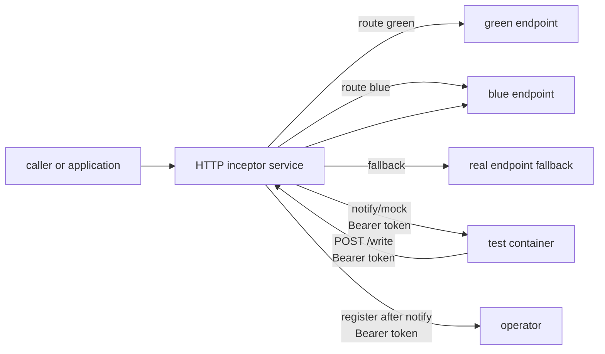
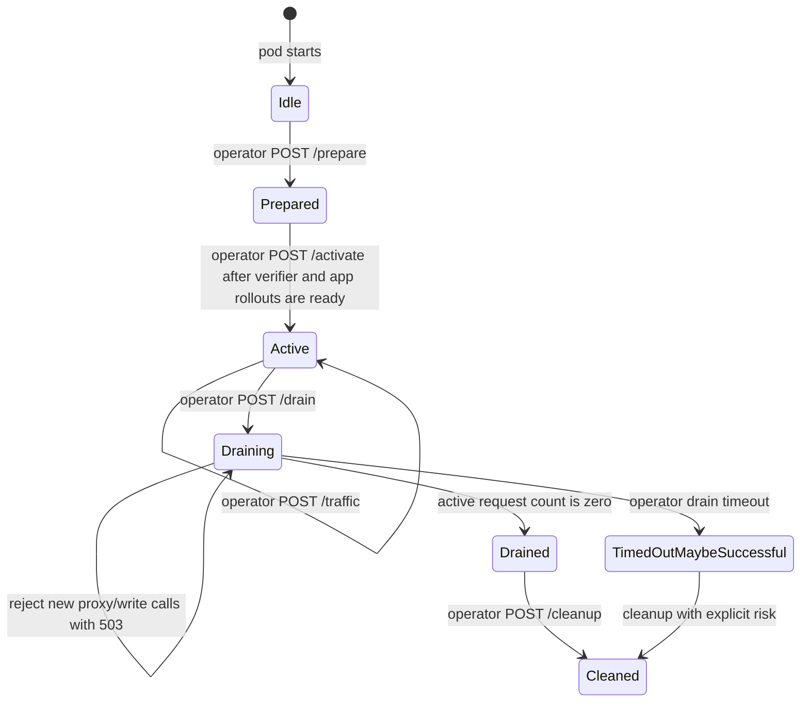
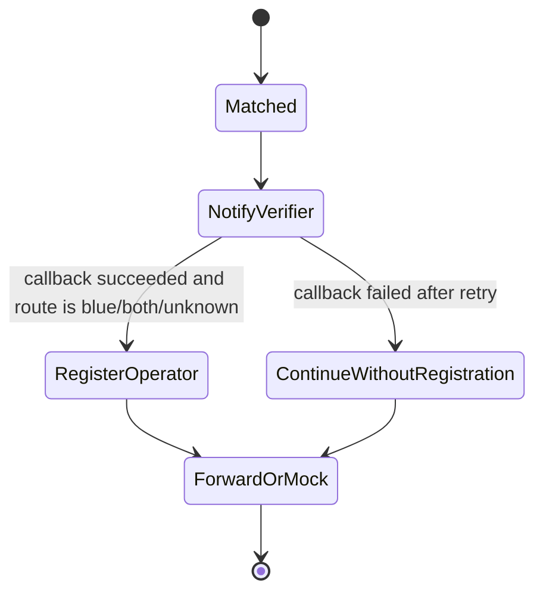

# HTTP Plugin

## Identity And Topology

| Field | Value |
|---|---|
| Built-in plugin name | `http` |
| Image | `ghcr.io/dlahmad/fbg-plugin-http` |
| Supported roles | `splitter`, `observer`, `mock`, `writer` |
| Progressive shifting | Supported for `splitter` |
| Manager mode | Not used |

The HTTP plugin is a single standalone inceptor service. It does not need an
external infrastructure manager because it does not create broker resources.

For a compact matrix of supported modes, TLS behavior, and proxy limitations,
see [HTTP Plugin Capabilities](http-capabilities.md).

```mermaid
flowchart LR
    CLIENT["caller or application"]
    HP["HTTP inceptor service"]
    GREEN["green endpoint"]
    BLUE["blue endpoint"]
    UP["real endpoint fallback"]
    TEST["test container"]
    OP["operator"]

    CLIENT --> HP
    HP -->|"route green"| GREEN
    HP -->|"route blue"| BLUE
    HP -->|"fallback"| UP
    HP -->|"notify/mock<br/>Bearer token"| TEST
    HP -->|"register after notify<br/>Bearer token"| OP
    TEST -->|"POST /write<br/>Bearer token"| HP
    HP --> BLUE
```

## Configuration Reference

| Field | Required | Used By | Meaning |
|---|---|---|---|
| `port` | no | all roles | Inceptor listen port. Defaults to `9090`. |
| `realEndpoint` | proxy/write fallback | splitter, observer, mock, writer | Default upstream target. Supports `{testContainerUrl}` template replacement. |
| `proxyProtocol` | no | operator assignments | `http` or `https` scheme injected into the application env var. |
| `writeProtocol` | no | operator assignments | `http` or `https` scheme injected into the verifier `/write` env var. |
| `greenEndpoint` | splitter | splitter | Explicit green route target. Falls back to `realEndpoint`. |
| `blueEndpoint` | splitter | splitter | Explicit blue route target. Falls back to `realEndpoint`. |
| `targetUrl` | writer | writer | Explicit `/write` target. Falls back to `realEndpoint`. |
| `verifierEndpoint` | no | observer, mock | Optional verifier base URL override. Defaults to the operator-created test service URL. |
| `mockPath` | mock | mock | Default verifier endpoint used to produce mock responses. |
| `envVarName` | no | operator assignments | Application env var patched to route calls through the plugin service. |
| `writeEnvVar` | no | operator assignments | Test-container env var patched with the plugin `/write` URL. |
| `testId` | observer/mock registration | observer, mock | Selector used to extract a test id from body, path, header, or static value. |
| `match` | no | observer, mock | Root filter set. All conditions must match. |
| `filters` | no | observer, mock | Filter-specific `notifyPath` and payload selection. |
| `filters[].mockPath` | no | mock | Filter-specific verifier endpoint used for mock responses. |
| `tls.inbound` | no | app/verifier to plugin | Optional HTTPS traffic listener configuration. |
| `clientTls` | no | plugin to upstream/verifier | Optional outbound TLS trust configuration. |
| `ingress` / `egress` | no | observer, mock | Directional filter grouping. Current behavior is equivalent to additional filters. |

`realEndpoint`, `greenEndpoint`, `blueEndpoint`, and `targetUrl` can reference
`{testContainerUrl}` or `{{testContainerUrl}}` when the endpoint should point at
the test container created for the rollout.

If the configured endpoint already includes a path and the incoming request path
is `/`, the plugin preserves the configured path and only appends the incoming
query string. This supports application env vars that point directly at a real
endpoint such as `http://service/post` and are temporarily replaced with the
plugin service root during a rollout.

## Role Behavior

| Role | Behavior | Assignments |
|---|---|---|
| `splitter` | Proxies requests and routes to green or blue based on current traffic percentage. | Patches `envVarName` so the application calls the plugin service. |
| `observer` | Filters requests, extracts `testId`, posts `notifyPath`, then registers blue/both/unknown cases with the operator. | None. |
| `mock` | For matched requests that have a filter-specific or top-level `mockPath`, forwards the call to the verifier mock endpoint and returns that verifier response to the original caller. Observer-only filters continue to the real upstream. | None. |
| `writer` | Exposes `/write` and forwards verifier-initiated HTTP calls to `targetUrl` or fallback endpoint. | Patches `writeEnvVar` for the verifier container. |

HTTP roles are additive. The fallback proxy is active only when `splitter`,
`observer`, or `mock` is selected. `/write` is active only when `writer` is
selected. Selecting `writer` does not disable proxy/observer behavior, and
selecting proxy roles does not expose `/write`.

Progressive shifting uses `POST /traffic`; `FLUIDBG_TRAFFIC_PERCENT` is only the
startup default. Normal step changes do not restart the plugin pod.

The plugin can stream pure proxy/mock request bodies and streams upstream
responses back to the caller. It uses bounded buffering when body inspection is
required for observer filters, body-based `testId` extraction, or splitter
routing.

## Runtime State Machine

```mermaid
stateDiagram-v2
    [*] --> Idle: pod starts
    Idle --> Prepared: operator POST /prepare
    Prepared --> Active: operator POST /activate after verifier and app rollouts are ready
    Active --> Active: proxy, observe, mock, write
    Active --> Active: operator POST /traffic
    Active --> Draining: operator POST /drain
    Draining --> Draining: reject new proxy/write calls with 503
    Draining --> Drained: active request count is zero
    Draining --> TimedOutMaybeSuccessful: operator drain timeout
    Drained --> Cleaned: operator POST /cleanup
    TimedOutMaybeSuccessful --> Cleaned: cleanup with explicit risk
```

Observer sub-state:

```mermaid
stateDiagram-v2
    [*] --> Matched
    Matched --> NotifyVerifier
    NotifyVerifier --> RegisterOperator: callback succeeded and route is blue/both/unknown
    NotifyVerifier --> ContinueWithoutRegistration: callback failed after retry
    RegisterOperator --> ForwardOrMock
    ContinueWithoutRegistration --> ForwardOrMock
    ForwardOrMock --> [*]
```

The plugin does not provide durable replay for HTTP requests. A failed verifier
callback prevents operator registration, but the original HTTP request may still
continue to the configured upstream because HTTP has no broker-level redelivery.

## Failure Behavior

| Situation | Behavior |
|---|---|
| Verifier readiness is slow or app rollout is still updating | The plugin stays idle and rejects proxy/write calls with `503`; application traffic remains on the previous wiring until activation. |
| `activate` is not called | The inceptor remains idle even if its Service exists. |
| No matching filter or no `testId` | The request can still proxy/mock normally, but no verifier callback and no operator case are created. |
| Verifier notification fails after retry | The operator case is not registered, preventing false pass counts. The HTTP request continues according to proxy/mock configuration. |
| Operator registration fails after verifier notification | The plugin logs the error; the case is not counted by the operator. |
| Upstream call fails | The plugin returns `502 upstream error`. |
| Mock verifier call fails | The plugin returns `502 upstream error`; the real upstream is not called for matched mock requests. |
| Mixed observer/mock filters and the matched filter has no `mockPath` | The request is observed, then proxied to the real upstream. |
| `realEndpoint`/route target is missing | The plugin returns `502 realEndpoint not configured` for proxy paths, or `400 targetUrl not configured` for `/write`. |
| `mockPath` is missing for a matched mock request | The plugin returns `502 mockPath not configured for HTTP mock role`. |
| Drain has started | New proxy and `/write` calls are rejected with `503`. Already admitted calls are allowed to finish. |
| Drain timeout | The operator records `TimedOutMaybeSuccessful` and proceeds with cleanup. |

## TLS Configuration

TLS is optional and independent for each side:

| Side | How to configure |
|---|---|
| Application or verifier to plugin | Keep HTTP by default, or set `tls.inbound.enabled: true` and inject `https://...` with `proxyProtocol: https` and/or `writeProtocol: https`. |
| Plugin to real upstream | Use `https://...` in `realEndpoint`, `greenEndpoint`, `blueEndpoint`, or `targetUrl`. |
| Plugin to verifier/mock endpoint | Use `https://...` in `verifierEndpoint` or rely on an HTTPS operator-provided test service URL if configured externally. |
| Operator to HTTP inceptor lifecycle | Set `InceptionPlugin.spec.inceptor.controlPlaneTls.enabled=true` and point it at the HTTPS control listener port. With the built-in chart this is `builtinPlugins.http.controlPlaneTls`, which starts a separate HTTPS lifecycle listener so proxy traffic can remain HTTP or use its own inbound TLS settings. |
| HTTP inceptor to operator `/testcases` | Enable operator API TLS with Helm `operator.api.tls.enabled=true`; mount a private CA into the inceptor and set `operator.api.tls.caCertPath` when the certificate is not publicly trusted. |

For private/internal CAs, mount the server certificate/key Secret and CA bundle
into the generated inceptor pod through the `InceptionPlugin` `inceptor.volumes`
and `inceptor.volumeMounts` fields. With the Helm chart, use
`builtinPlugins.http.inceptorVolumes` and
`builtinPlugins.http.inceptorVolumeMounts`. Then point
`tls.inbound.certPath`, `tls.inbound.keyPath`, and `clientTls.caCertPath` at the
mounted files. `clientTls.insecureSkipVerify` exists for local testing only.

## Drain And Cleanup

HTTP activation and drain are admission barriers. Before activation the plugin
rejects proxy and writer calls. The drain call flips the plugin into draining
mode; a request guard rejects new proxy and writer calls even if drain starts
concurrently with request admission. Drain status returns `drained: true` only
when the active admitted request count reaches zero.

The operator restores application wiring before deleting the plugin service, so
new traffic should go directly to the surviving deployment after promotion or
rollback. HTTP cannot guarantee replay of in-flight client requests; the design
minimizes loss by avoiding plugin pod restarts during progressive shifts and by
waiting for admitted calls before cleanup.

## Security Boundary

The HTTP inceptor verifies the per-inception token on lifecycle endpoints and
`/write`. It does not receive infrastructure management credentials. The same
token is used for plugin-to-operator test-case registration, operator lifecycle
calls to the plugin, plugin-to-verifier observer callbacks, plugin-to-verifier
mock calls, and operator polling of verifier results.

Verifier containers receive `FLUIDBG_VERIFIER_AUTH_TOKENS_JSON`, a map from
inception point name to token. They can use it to reject callbacks, mock calls,
result polling, or `/write` calls that do not come from the matching FluidBG
inception point. The verifier never receives the operator signing key.
