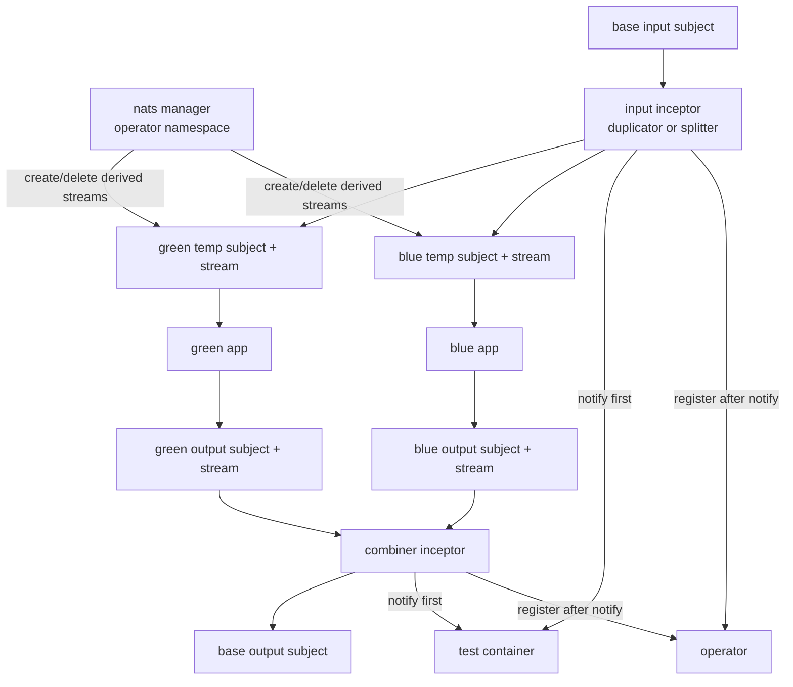
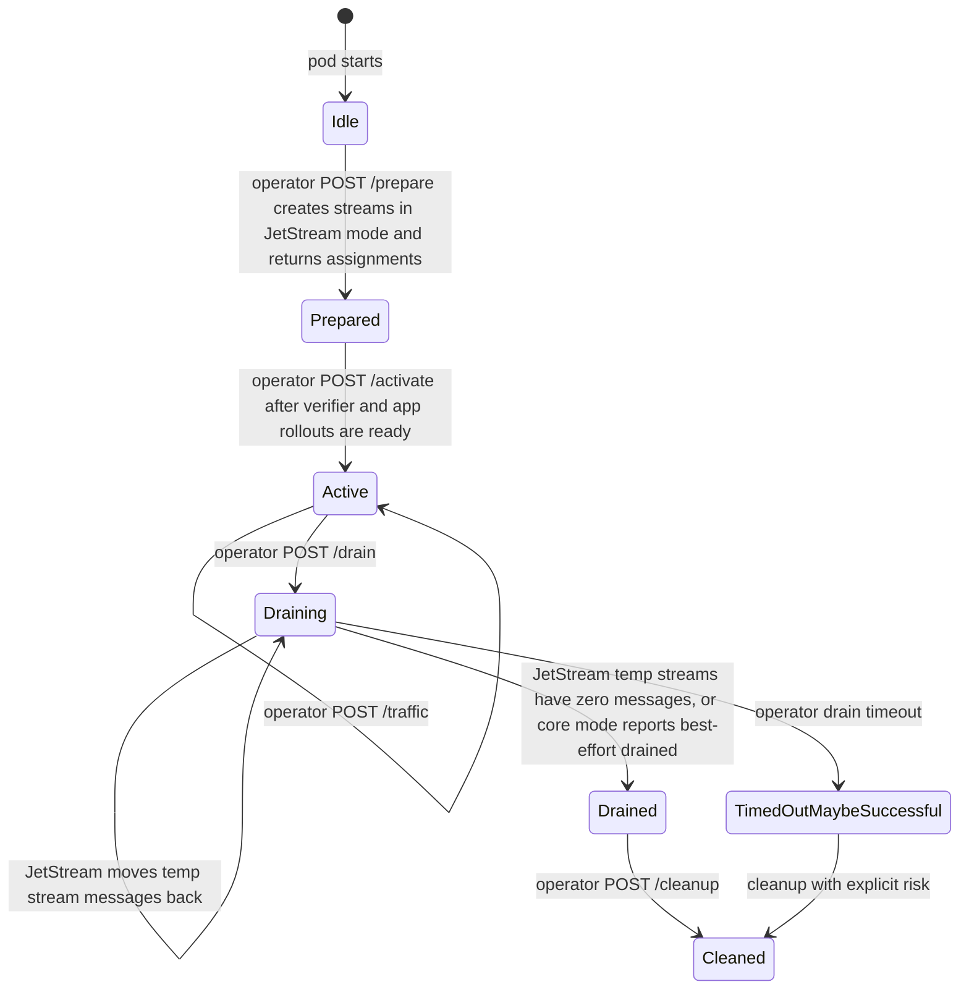

# NATS Plugin

## Identity And Topology

| Field | Value |
|---|---|
| Built-in plugin name | `nats` |
| Image | `ghcr.io/dlahmad/fbg-plugin-nats` |
| Supported roles | `duplicator`, `splitter`, `combiner`, `observer`, `writer`, `consumer` |
| Progressive shifting | Supported for `splitter` |
| Manager mode | Supported and recommended |

The NATS plugin supports two explicit transport modes. `jetStream` is the
default and recommended mode; it uses JetStream streams, durable consumers,
confirmed ACKs, and pending/ack-pending drain checks for queue-like no-loss
rollouts. `core` uses plain NATS publish/subscribe for live best-effort traffic
only. Core mode can test event-style systems but cannot recover missed,
in-flight, or temporarily routed messages during promotion or rollback.

The manager runs in the operator namespace, owns JetStream stream
creation/deletion when `mode: jetStream`, and returns runtime env for
per-inception inceptors. Application namespaces should not receive the
manager's administrative NATS credential. If your NATS account uses separate
limited credentials for app traffic, configure
`builtinPlugins.nats.manager.inceptorUrl`; otherwise the manager URL is reused.

## Configuration Reference

Top-level fields:

| Field | Required | Used By | Meaning |
|---|---|---|---|
| `mode` | no | manager/inceptor setup | `jetStream` by default. Set `core` for plain NATS best-effort pub/sub. |
| `stream` | no | manager/inceptor setup | JetStream stream properties for created streams. Ignored in `core` mode. |
| `duplicator` | when role active | `duplicator` | Base input and green/blue input subjects plus env vars to patch. |
| `splitter` | when role active | `splitter` | Base input and green/blue input subjects plus env vars to patch. |
| `combiner` | when role active | `combiner` | Green/blue output subjects, base output subject, and env vars to patch. |
| `writer` | when role active | `writer` | Target subject for `/write`. |
| `consumer` | when role active | `consumer` | Input subject for consumer-style reads. |
| `observer` | when role active | `observer` | Test id selector, match filters, and verifier callback path. |

`stream` supports `subjects`, `storage`, `retention`, `replicas`,
`maxMessages`, `maxBytes`, `maxAgeSeconds`, `discard`, `allowRollup`,
`denyDelete`, `denyPurge`, `placement`, `persistenceMode`,
`subjectTransform`, and `metadata`. Stream names are always derived by the
plugin from the subject so each managed base or temporary subject maps to a
bounded, collision-resistant FluidBG-owned stream. If `stream.subjects` is set,
the active subject is added to that list so the generated stream still captures
the traffic the role uses.

`duplicator`, `splitter`, and `combiner` may set
`temporarySubjectIdentifier` to a semantic value up to 40 characters using
letters, digits, `.`, `_`, or `-`. The SDK converts it to a fixed
10-character safe token before including it in derived temporary subject names,
for example `fluidbg-green-in-incomiada9-<hash>`.

## Role Behavior

| Role | Behavior | Assignments |
|---|---|---|
| `duplicator` | Pulls from `duplicator.inputSubject` in JetStream mode or subscribes in core mode, then publishes every message to green and blue temporary subjects. Route metadata is `both`. | Patches green and blue input subject and queue-group env vars. |
| `splitter` | Pulls from `splitter.inputSubject` in JetStream mode or subscribes in core mode, then publishes each message to green or blue based on current candidate traffic percentage. | Patches green and blue input subject and queue-group env vars. |
| `combiner` | Pulls/subscribes from green and blue output subjects, republishes to `combiner.outputSubject`, and derives route metadata from the source subject. | Patches green and blue output subject env vars. |
| `observer` | Applies `observer.match`, extracts `testId`, posts `observer.notifyPath`, then registers operator cases for `blue`, `both`, and `unknown` routes. | None. |
| `writer` | Exposes `/write` and publishes the supplied JSON payload to `writer.targetSubject`. | Test-container env injection can point callers to the writer service. |
| `consumer` | Pulls from `consumer.inputSubject` for plugin-driven read flows. | None. |

`duplicator`, `splitter`, `combiner`, and `consumer` are mutually exclusive
movement roles for one NATS inceptor. `observer` and `writer` are additive.

For queue-like no-loss semantics, configure `queueGroup`,
`greenQueueGroup`, `blueQueueGroup`, `greenQueueGroupEnvVar`, and
`blueQueueGroupEnvVar` on `duplicator` or `splitter` roles. The application
should consume JetStream with a durable derived from the subject plus the
current queue-group env var. The inceptor uses the same base queue-group
durable while it is active, so it work-shares with the current green app
instead of creating an independent replaying subscription. During drain, it
uses the green/blue durable names to detect messages already delivered to app
pods and to move only still-pending temporary work back to the base subject.

In `core` mode, the queue-group values are used as plain NATS queue groups for
load balancing. They do not create durable backlog or ACK state.

## Mode Semantics

| Capability | `jetStream` | `core` |
|---|---|---|
| Publish/subscribe | Yes | Yes |
| Duplicator, splitter, combiner | Yes | Yes, best effort |
| Observer and writer | Yes | Yes, best effort |
| Durable backlog | Yes | No |
| ACK and redelivery | Yes | No |
| Move temporary input messages back to base during drain | Yes | No |
| Move temporary output messages back to base during drain | Yes | No |
| Drain waits for pending and ack-pending messages | Yes | No, drain is reported as best-effort complete |
| Recommended for work queues | Yes | No |
| Suitable for lossy event telemetry | Possible, but stronger than needed | Yes |

## Runtime State Machine

The source message is acknowledged only after required downstream publish work
and verifier notification have succeeded. Plugin-owned acknowledgements use
JetStream confirmed ACKs, so drain status is based on server-observed consumer
state instead of a best-effort client send. If an error occurs first, the
message is left unacknowledged so JetStream can redeliver according to its
consumer policy.

Core mode has no ACK protocol. The inceptor subscribes only after activation
and stops subscriptions on drain, but any message published without a matching
subscriber, delivered to a crashing process, or in flight during a switch can be
lost by NATS itself. This is expected and is why core mode must not be used for
queue-like no-loss rollouts.

## Failure Behavior

| Situation | Behavior |
|---|---|
| Stream creation fails | `prepare` fails; the operator retries reconciliation and the rollout does not enter `Observing`. |
| Verifier readiness is slow or app rollout is still updating | The plugin stays idle and does not pull from base subjects. Existing green traffic continues through the old wiring. |
| Downstream publish fails | The source message is not acknowledged; JetStream can redeliver. |
| Downstream publish fails in core mode | The plugin logs the error; the source message cannot be redelivered by plain NATS. |
| Verifier notification fails after retry | The operator case is not registered, preventing false promotion counts. |
| Operator registration fails after verifier notification | The plugin logs the error. The case is not counted until registration succeeds on a later delivery. |
| Green-only progressive observation | The verifier may be notified, but no operator case is registered. |
| Drain timeout | The operator records `TimedOutMaybeSuccessful` and proceeds with cleanup. |

## Drain And Cleanup

During drain, input roles stop pulling new base-subject work and move available
messages from temporary green/blue streams back to the base subject. They use
the configured green/blue queue-group durables, so messages already delivered
to an app pod remain visible as ack-pending until the app acknowledges or
JetStream redelivers them. Combiner roles move temporary output stream
messages back to the base output subject using the same durable the active
combiner uses. Drain status returns success only after all relevant temporary
durables have zero pending and zero ack-pending messages.

In `core` mode, drain is a control-plane state transition only. The inceptor
stops subscribing and returns a drain status message that explicitly says core
NATS has no durable pending or ack-pending state. No temporary messages can be
moved back because plain NATS does not store them.

Cleanup deletes only derived stream names recomputed from token claims and
active roles. Derived subjects and stream names include purpose plus a bounded
hash; user-supplied subject names are not trusted for manager cleanup. The
manager also supports `/manager/sync`, allowing the operator to send active
inception inventory so missed temporary streams can be garbage-collected after
manager restarts.

## Security Boundary

The manager verifies the per-inception JWT and derives namespace, BGD,
inception point, and plugin identity from claims. NATS URLs are plugin
installation/runtime configuration, not BGD config. The BGD only describes
subjects, stream properties, role behavior, and verifier matching.

Configure the manager with:

| Helm value | Meaning |
|---|---|
| `builtinPlugins.nats.manager.url` or `urlSecretName`/`urlSecretKey` | Manager NATS URL used for JetStream stream management and publishing. |
| `builtinPlugins.nats.manager.inceptorUrl` | Optional limited runtime URL returned to inceptor pods as `FLUIDBG_NATS_URL`. |
| `builtinPlugins.nats.manager.requireTls` | Sets `FLUIDBG_NATS_REQUIRE_TLS=true`. |
| `builtinPlugins.nats.manager.caCertPath` | PEM bundle path used by manager and inceptors as `FLUIDBG_NATS_CA_CERT_PATH`. |

Publicly trusted NATS TLS certificates work with `tls://` URLs without extra
configuration. For private CAs, mount the PEM bundle into the manager and
inceptor pods and set `caCertPath`. Control-plane TLS between operator,
manager, and inceptors is separate; use
`builtinPlugins.nats.manager.controlPlaneTls` and
`builtinPlugins.nats.controlPlaneTls`.
