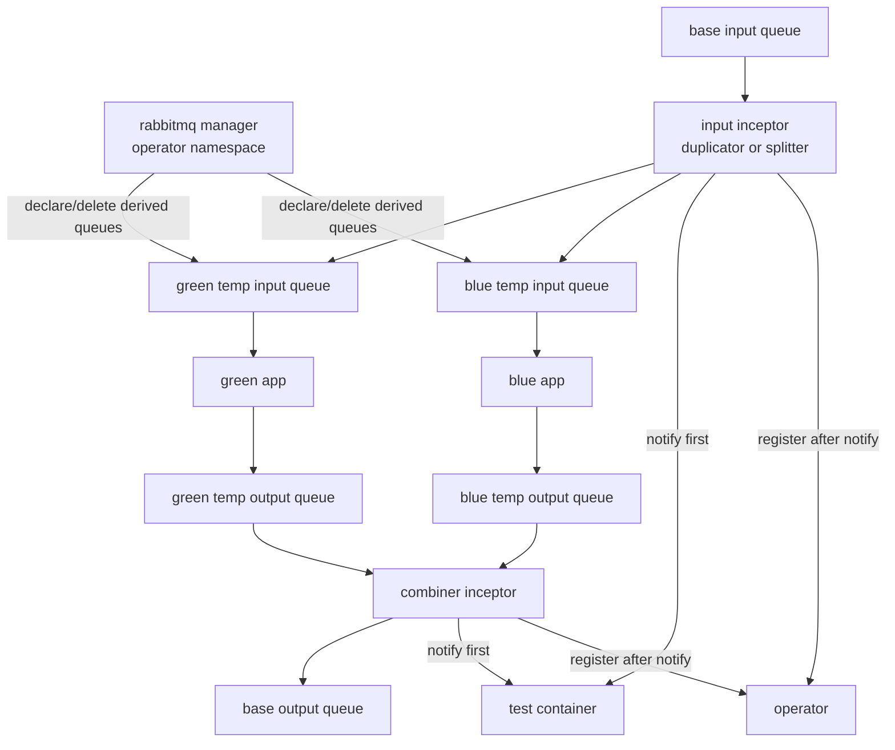
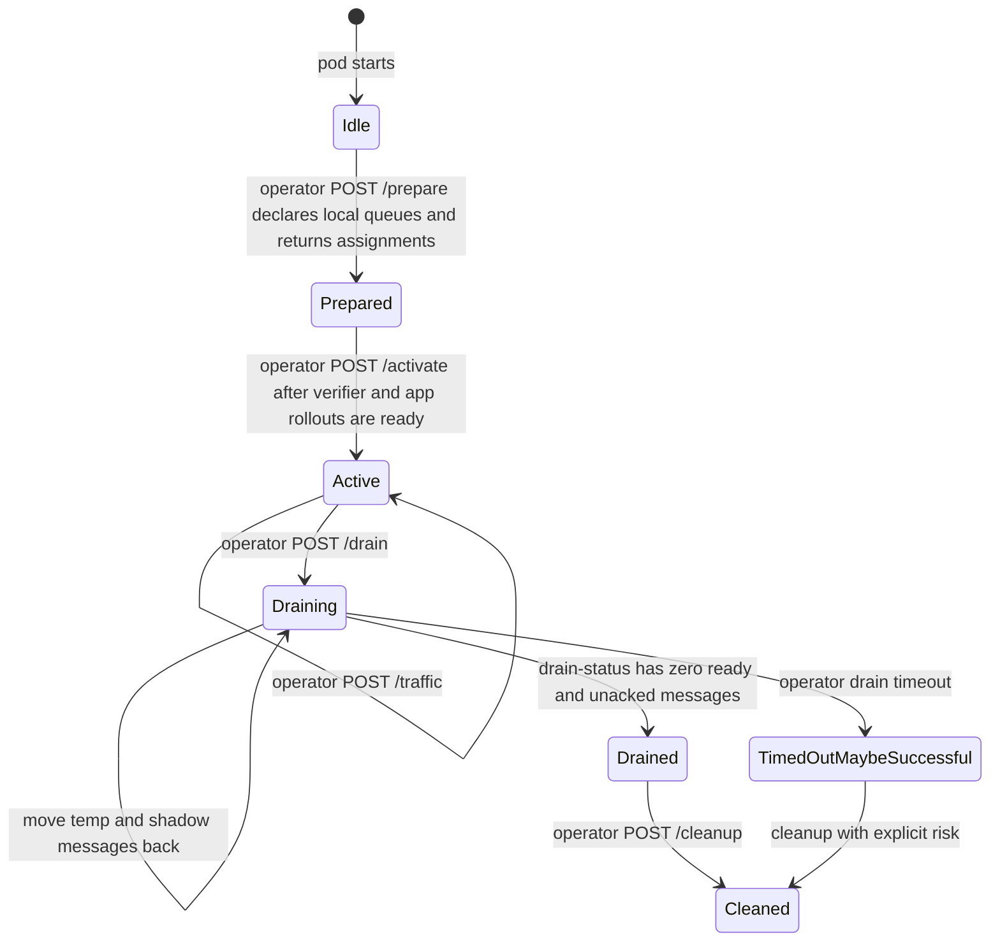
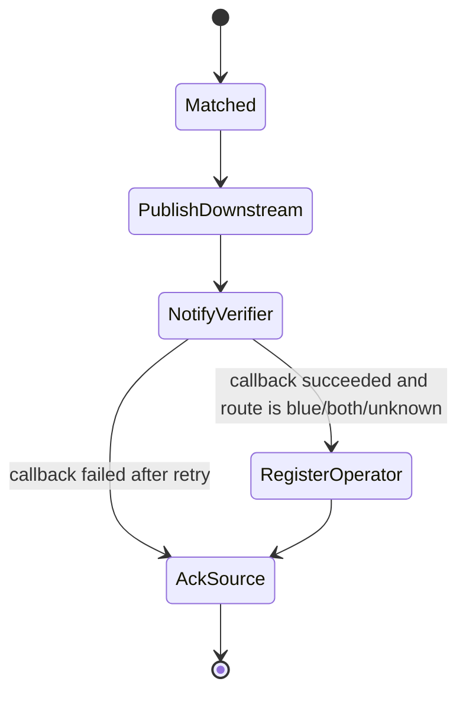

# RabbitMQ Plugin

## Identity And Topology

| Field | Value |
|---|---|
| Built-in plugin name | `rabbitmq` |
| Image | `ghcr.io/dlahmad/fbg-plugin-rabbitmq` |
| Supported roles | `duplicator`, `splitter`, `combiner`, `observer`, `writer`, `consumer` |
| Progressive shifting | Supported for `splitter` |
| Manager mode | Supported and recommended |

RabbitMQ uses split plugin mode when `InceptionPlugin.spec.manager` is enabled.
The manager runs in the operator namespace and owns queue create/delete
permissions. Per-inception inceptors run in the application namespace and
receive only rewritten temporary queue names, a per-inception token, and scoped
RabbitMQ runtime credentials returned by authenticated manager prepare.

## Configuration Reference

Top-level fields:

| Field | Required | Used By | Meaning |
|---|---|---|---|
| `queueDeclaration` | no | manager or inceptor setup | Declaration settings for temporary queues. |
| `shadowQueue` | no | manager, drain | Optional additional queue next to each temporary queue, commonly used for dead-letter style flows. |
| `duplicator` | when role active | `duplicator` | Base input and green/blue input queue names plus env vars to patch. |
| `splitter` | when role active | `splitter` | Base input and green/blue input queue names plus env vars to patch. |
| `combiner` | when role active | `combiner` | Green/blue output queue names, base output queue, and env vars to patch. |
| `writer` | when role active | `writer` | Target queue for `/write`. |
| `consumer` | when role active | `consumer` | Input queue for consumer-style reads. |
| `observer` | when role active | `observer` | Test id selector, match filters, and verifier callback path. |

`queueDeclaration` supports `durable`, `exclusive`, `autoDelete`, and AMQP
`arguments`. The plugin does not infer dead-letter configuration. If a temporary
queue should dead-letter into a shadow queue, configure RabbitMQ arguments such
as `x-dead-letter-exchange` and `x-dead-letter-routing-key` explicitly.

`duplicator`, `splitter`, and `combiner` may set
`temporaryQueueIdentifier` to a semantic value up to 40 characters using
letters, digits, `.`, `_`, or `-`. The SDK converts it to a fixed 10-character
safe token before including it in derived temporary queue names, for example
`fluidbg-green-in-incomiada9-<hash>`. Generated queue names remain within the
RabbitMQ-safe 63-character bound while still letting operators identify which
base queue or inception point owns a temporary queue without embedding long or
sensitive names.

`shadowQueue.suffix` is preserved after validation. For short names it is
appended directly. For already-long generated temporary names it is inserted
before the stable hash suffix so the resulting queue name stays bounded and
still cannot collide. The suffix may be `_dlq`, `.dlq`, or another safe suffix.
`shadowQueue.queueDeclaration` configures shadow queues independently from
regular temporary queues.

## Role Behavior

| Role | Behavior | Assignments |
|---|---|---|
| `duplicator` | Consumes `duplicator.inputQueue` and republishes every message to both `greenInputQueue` and `blueInputQueue`. Observer filters affect only verification callbacks, never message routing. Route metadata is `both`. | Patches green and blue input queue env vars. |
| `splitter` | Consumes `splitter.inputQueue` and routes every message to green or blue based on current traffic percentage. Observer filters affect only verification callbacks, never message routing. | Patches green and blue input queue env vars. |
| `combiner` | Consumes green and blue output queues, republishes to `combiner.outputQueue`, and derives route metadata from the source queue. | Patches green and blue output queue env vars. |
| `observer` | Applies `observer.match`, extracts `testId`, posts `observer.notifyPath`, then registers operator cases for `blue`, `both`, and `unknown` routes. | None. |
| `writer` | Exposes `/write` and publishes the supplied JSON payload to `writer.targetQueue`. | Test-container env injection can point callers to the writer service. |
| `consumer` | Consumes from `consumer.inputQueue` for plugin-driven read flows. | None. |

Progressive shifting uses `POST /traffic`; `FLUIDBG_TRAFFIC_PERCENT` is only the
startup default. Normal step changes do not restart the plugin pod.

## Runtime State Machine

Observer sub-state:

The source message is acknowledged only after required downstream publish work
and required verifier notification have succeeded. If an error occurs before
that point, the message is not acknowledged and RabbitMQ can redeliver it.

## Failure Behavior

| Situation | Behavior |
|---|---|
| Temporary queue declaration fails | `prepare` fails; the operator retries reconciliation and the rollout does not enter `Observing`. |
| Verifier readiness is slow or app rollout is still updating | The plugin stays `Prepared`/idle and does not consume from base queues or move output messages. Existing green traffic continues through the old wiring. |
| `activate` is not called | The inceptor remains idle even if its pod and temporary queues exist. |
| Downstream publish fails | The source message is not acknowledged; RabbitMQ can redeliver. |
| Verifier notification fails after retry | The source message is not acknowledged where the role still owns a delivery; the operator case is not registered, preventing false promotion counts. |
| Operator registration fails after verifier notification | The plugin logs the error. The case is not counted until registration succeeds on a later delivery. |
| Green-only progressive observation | The verifier may be notified, but no operator case is registered. |
| Drain status without management env | The plugin can only prove ready-message absence through AMQP. It reports the limitation in `message`. |
| Drain timeout | The operator records `TimedOutMaybeSuccessful` and proceeds with cleanup. |

## Drain And Cleanup

Before activation the plugin never consumes from base queues. During drain the
plugin stops accepting new temporary work and actively retries
idempotent message movement from both `POST /drain` and `GET /drain-status`.
Regular temporary queue messages move back to the matching base queue. Temporary
shadow queue messages move back to the matching base shadow queue, not the
regular base queue.

With `FLUIDBG_RABBITMQ_MANAGEMENT_URL`, drain status waits for `messages_ready == 0` and
`messages_unacknowledged == 0` on all relevant temporary queues and shadow
queues. Consumer counts are diagnostic only; if no messages remain, attached
consumers do not block cleanup.

Cleanup deletes only derived queue names recomputed from token claims and active
roles. Derived temporary queue names expose only route/purpose plus a stable
hash, for example `fluidbg-green-in-<hash>` or `fluidbg-blue-out-<hash>`. The
hash input includes namespace, BGD name, BGD UID, inception point, role, and
logical queue purpose, but those values are not exposed in the queue name.
User-supplied queue names are not trusted for manager cleanup. The manager also
supports `/manager/sync`; the operator periodically sends the active inception
inventory so the manager can remove scoped RabbitMQ users and FluidBG-owned
temporary queues that missed normal cleanup.

## Security Boundary

The manager verifies the per-inception JWT and derives namespace, BGD,
inception point, and plugin identity from claims. This prevents an attacker who
controls the application namespace from using a BGD to request arbitrary queue
creation or deletion.

RabbitMQ connection and management credentials are never valid BGD config.
Configure them at plugin installation time. The manager reads
`FLUIDBG_RABBITMQ_MANAGER_AMQP_URL` and
`FLUIDBG_RABBITMQ_MANAGER_MANAGEMENT_*` from Secrets. On prepare it creates a
bounded, deterministic, per-inception RabbitMQ user with read permissions
limited to the derived temporary queues, configured shadow queues, and
explicitly required base queues for movement/writer/consumer behavior. Write
permission is limited to RabbitMQ's default exchange used for queue-routed
publishing. It returns
`FLUIDBG_RABBITMQ_AMQP_URL` and optional `FLUIDBG_RABBITMQ_MANAGEMENT_*` values
for that scoped user as `inceptorEnv`.
