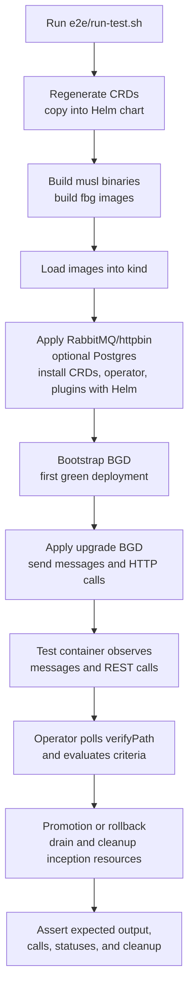
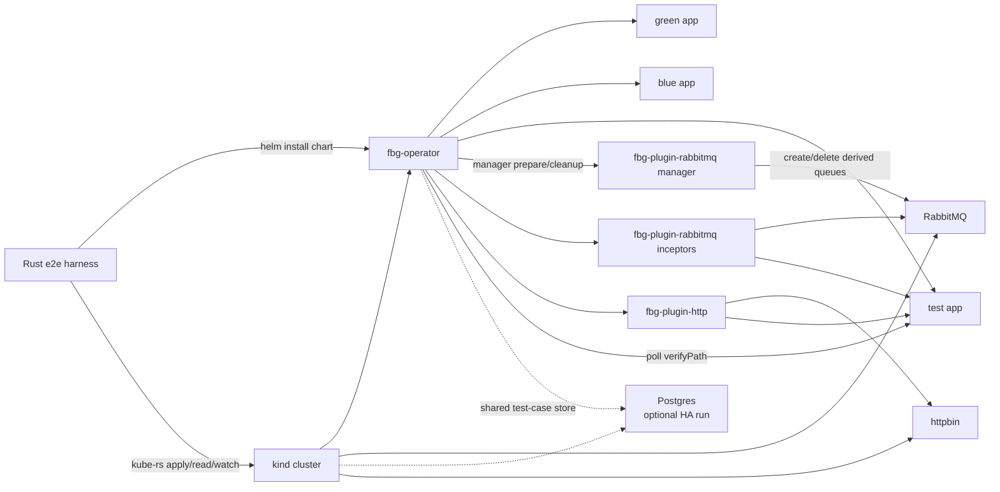
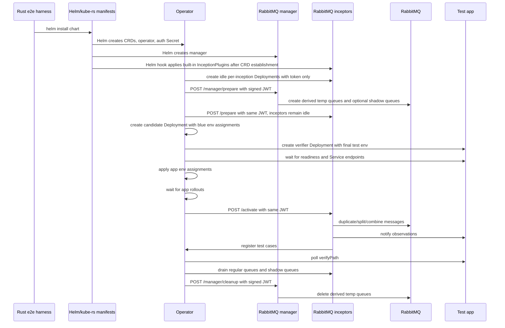

# E2E Test Flow

The e2e suite is a Rust integration-test crate in `e2e/`. `e2e/run-test.sh` is
only a compatibility wrapper around `cargo test -p fluidbg-e2e-tests --test e2e`.
The suite tests the operator, built-in plugins, CRDs, and example applications
against a kind cluster with local dev images by default.

## Suite Flow



## Covered Scenarios

- Bootstrap from no existing green deployment.
- Successful queue-driven promotion.
- Rollback with queue-drain recovery.
- Progressive traffic shifting through a splitter plugin without restarting the plugin pod.
- Rejection of progressive strategy when the splitter plugin does not advertise `supportsProgressiveShifting`.
- Combined HTTP plugin proxy, observer, mock, and writer behavior.
- Multiple inception points in one test case, where both expected HTTP calls and expected output messages must be observed before success.
- Test verifier readiness and app rollout readiness before plugin activation,
  so inceptors cannot send observations to a test Service without ready
  endpoints or steal base-queue work before the candidate has the test wiring.
  The e2e verifier uses a native Kubernetes `readinessProbe`; there is no
  FluidBG-specific readiness abstraction.
- Promotion and rollback drain safety for RabbitMQ temporary queues, including
  messages in regular and shadow queues, and verification that promoted output
  messages are present on the restored base queue.
- Test-time deployment patching, including a lower candidate replica count during observation and canonical replica count after promotion.
- Same-`BlueGreenDeployment` rollout serialization so a new rollout cannot start while previous inception resources still exist.
- Different `BlueGreenDeployment` names running without generated-name collisions.
- Forced-delete recovery for missing BGD CRs with finalizers removed.
- GitOps-friendly `Ready`, `Progressing`, and `Degraded` status conditions.
- Optional HA state-store run with two operator replicas and Postgres.

## State Store Modes

The consolidated `CI/CD` workflow runs this suite on release tag builds,
nightly schedules, and manual workflow dispatches with `run_e2e=true`. Normal
branch and pull-request runs still build and validate the project without
publishing release artifacts.

Manual e2e trigger:

```sh
gh workflow run "CI/CD" --repo dlahmad/fluidbgoperator --ref main -f run_e2e=true
```

Release-only jobs are intentionally tag-gated. They run when a `v*.*.*` tag is
pushed, not from manual dispatch.

The default e2e mode uses the in-memory state store and one operator replica:

```sh
KIND_CLUSTER=fluidbg-dev BUILD_IMAGES=1 ./e2e/run-test.sh
```

To verify the HA-safe backend path, run with Postgres and two operator replicas:

```sh
KIND_CLUSTER=fluidbg-dev BUILD_IMAGES=1 E2E_STATE_STORE=postgres OPERATOR_REPLICAS=2 ./e2e/run-test.sh
```

That mode deploys a local `postgres:18-alpine` instance, stores the connection
URL in `secret/fluidbg-postgres`, installs the operator through Helm with
`stateStore.type=postgres`, and waits for both operator replicas to become
ready. The chart intentionally rejects `OPERATOR_REPLICAS=2` with
`stateStore.type=memory`. The same run exercises per-BGD Kubernetes lease
coordination, so only one operator replica can perform side-effecting work for a
specific BGD at a time.

## Runtime Topology



## Plugin Manager/Inceptor Path



## Success Signal

The suite does not accept a rollout just because the operator status reached a
terminal phase. The Rust harness also inspects the test-app case state before
cleanup. The test app only returns success when every expected observation for a
test case has been seen. For combined queue/HTTP cases this means:

- The expected output message was emitted.
- The expected REST call was observed by the HTTP plugin.
- The observed events use plugin-supplied route metadata, not application-owned payload fields.
- Queue plugins notify the verifier before registering the case with the
  operator. The HTTP scenario holds promotion open until the harness has
  observed both verifier flags for an exact case, then sends the additional
  promotion case. This catches false-positive operator counts where a callback
  was never accepted by the verifier.
- The rollback path publishes messages into RabbitMQ temporary shadow queues and
  verifies they are moved back to matching base shadow queues such as
  `orders_dlq` and `results_dlq`.

## Cleanup Checks

After terminal promotion or rollback, the suite checks that temporary inception
resources are gone. This belongs to the operator, not the test container. The
operator performs drain, cleanup, and Kubernetes resource deletion; the test only
asserts that those effects happened.

The suite also force-deletes a BGD after it has created candidate, test,
inception, and store state. It removes the finalizer before deletion, then waits
for the orphan cleanup loop to remove all `fluidbg.io/blue-green-ref` labeled
resources for that BGD. In Postgres mode it additionally asserts that no store
rows remain for the force-deleted BGD.

The suite also uninstalls the Helm release and asserts that chart-owned
operator resources are removed: operator Deployment/Service/ServiceAccount,
manager Deployment/Service, built-in `InceptionPlugin` resources, RBAC, and the
chart-created signing Secret. Built-in plugin CRs are applied by Helm hook after
the CRD is established and deleted by a pre-delete hook on uninstall. CRDs are
managed by the chart during install; the harness only removes stale CRDs during
test reset.

## Harness Structure

- `e2e/src/harness.rs` owns environment setup: CRD regeneration, image build/load,
  infrastructure install, Helm install, and reset.
- `e2e/src/kube.rs` uses `kube-rs` and typed Kubernetes objects for BGD,
  InceptionPlugin, Deployment, Service, Secret, ConfigMap, Pod, RBAC, and CRD
  operations.
- `e2e/src/rabbitmq.rs` owns RabbitMQ management assertions and intentionally
  checks both ready and unacknowledged queue depth before accepting drain.
- `e2e/src/scenarios/` contains scenario tests grouped by behavior: promotion,
  rollback/drain recovery, progressive shifting, HTTP proxy/observer, forced
  deletion, and Helm cleanup.

The harness still shells out for non-Kubernetes-API boundaries: Helm, Docker,
kind image loading, CRD generation, RabbitMQ management port-forward, and the
single test-app `/cases` inspection currently done through `kubectl exec`.
