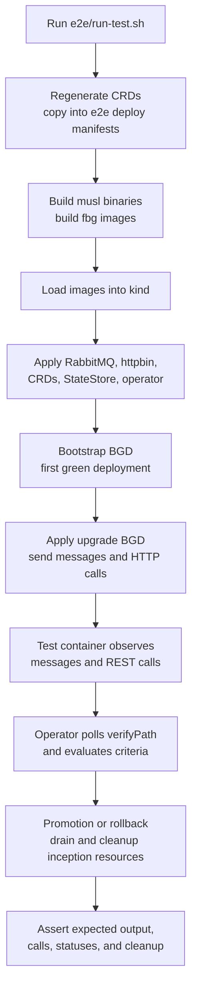
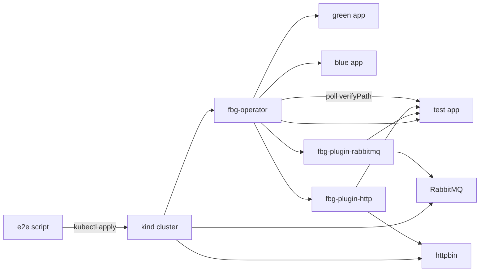

# E2E Test Flow

The e2e suite in `e2e/run-test.sh` is the executable system test for the
operator, built-in plugins, CRDs, and example applications. It runs against a
kind cluster and uses local dev images by default.

## Suite Flow

## Covered Scenarios

- Bootstrap from no existing green deployment.
- Successful queue-driven promotion.
- Rollback with queue-drain recovery.
- Progressive traffic shifting through a splitter plugin without restarting the plugin pod.
- Rejection of progressive strategy when the splitter plugin does not advertise `supportsProgressiveShifting`.
- Combined HTTP plugin proxy, observer, mock, and writer behavior.
- Multiple inception points in one test case, where both expected HTTP calls and expected output messages must be observed before success.
- Same-`BlueGreenDeployment` rollout serialization so a new rollout cannot start while previous inception resources still exist.
- Different `BlueGreenDeployment` names running without generated-name collisions.

## Runtime Topology

## Success Signal

The suite does not accept a rollout just because the operator status reached a
terminal phase. The test app only returns success when every expected observation
for a test case has been seen. For combined queue/HTTP cases this means:

- The expected output message was emitted.
- The expected REST call was observed by the HTTP plugin.
- The observed events use plugin-supplied route metadata, not application-owned payload fields.

## Cleanup Checks

After terminal promotion or rollback, the suite checks that temporary inception
resources are gone. This belongs to the operator, not the test container. The
operator performs drain, cleanup, and Kubernetes resource deletion; the test only
asserts that those effects happened.
