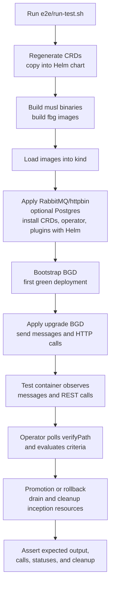
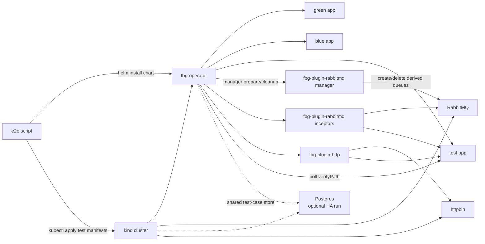
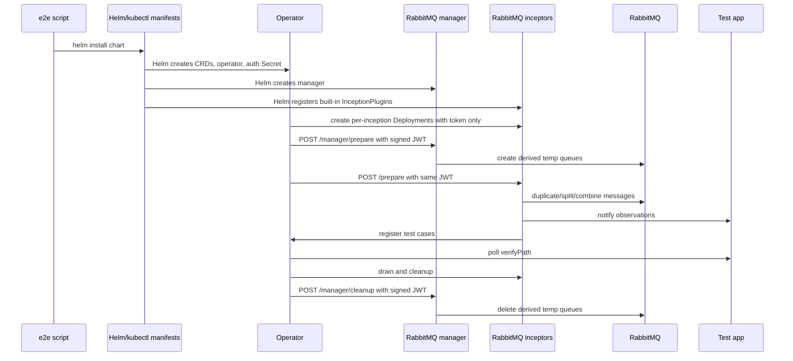

# E2E Test Flow

The e2e suite in `e2e/run-test.sh` is the executable system test for the
operator, built-in plugins, CRDs, and example applications. It runs against a
kind cluster and uses local dev images by default.

## Suite Flow



## Covered Scenarios

- Bootstrap from no existing green deployment.
- Successful queue-driven promotion.
- Rollback with queue-drain recovery.
- Progressive traffic shifting through a splitter plugin without restarting the plugin pod.
- Rejection of progressive strategy when the splitter plugin does not advertise `supportsProgressiveShifting`.
- Combined HTTP plugin proxy, observer, mock, and writer behavior.
- Multiple inception points in one test case, where both expected HTTP calls and expected output messages must be observed before success.
- Same-`BlueGreenDeployment` rollout serialization so a new rollout cannot start while previous inception resources still exist.
- Different `BlueGreenDeployment` names running without generated-name collisions.
- Forced-delete recovery for missing BGD CRs with finalizers removed.
- Optional HA state-store run with two operator replicas and Postgres.

## State Store Modes

The default e2e mode uses the in-memory state store and one operator replica:

```sh
KIND_CLUSTER=fluidbg-dev BUILD_IMAGES=1 ./e2e/run-test.sh
```

To verify the HA-safe backend path, run with Postgres and two operator replicas:

```sh
KIND_CLUSTER=fluidbg-dev BUILD_IMAGES=1 E2E_STATE_STORE=postgres OPERATOR_REPLICAS=2 ./e2e/run-test.sh
```

That mode deploys a local `postgres:18-alpine` instance, stores the connection
URL in `secret/fluidbg-postgres`, installs the operator through Helm with
`stateStore.type=postgres`, and waits for both operator replicas to become
ready. The chart intentionally rejects `OPERATOR_REPLICAS=2` with
`stateStore.type=memory`.

## Runtime Topology



## Plugin Manager/Inceptor Path



## Success Signal

The suite does not accept a rollout just because the operator status reached a
terminal phase. The test app only returns success when every expected observation
for a test case has been seen. For combined queue/HTTP cases this means:

- The expected output message was emitted.
- The expected REST call was observed by the HTTP plugin.
- The observed events use plugin-supplied route metadata, not application-owned payload fields.

## Cleanup Checks

After terminal promotion or rollback, the suite checks that temporary inception
resources are gone. This belongs to the operator, not the test container. The
operator performs drain, cleanup, and Kubernetes resource deletion; the test only
asserts that those effects happened.

The suite also force-deletes a BGD after it has created candidate, test,
inception, and store state. It removes the finalizer before deletion, then waits
for the orphan cleanup loop to remove all `fluidbg.io/blue-green-ref` labeled
resources for that BGD. In Postgres mode it additionally asserts that no store
rows remain for the force-deleted BGD.

The suite also uninstalls the Helm release and asserts that chart-owned
operator resources are removed: operator Deployment/Service/ServiceAccount,
manager Deployment/Service, built-in `InceptionPlugin` resources, RBAC, and the
chart-created signing Secret. CRDs are installed from the chart but are deleted
explicitly at the beginning of the next e2e run because Helm intentionally does
not remove CRDs on uninstall.
